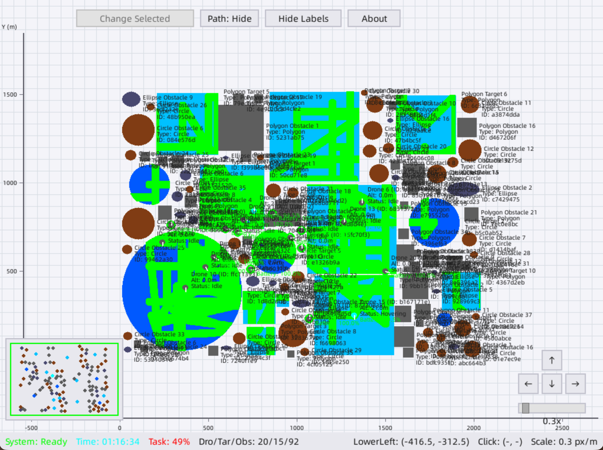
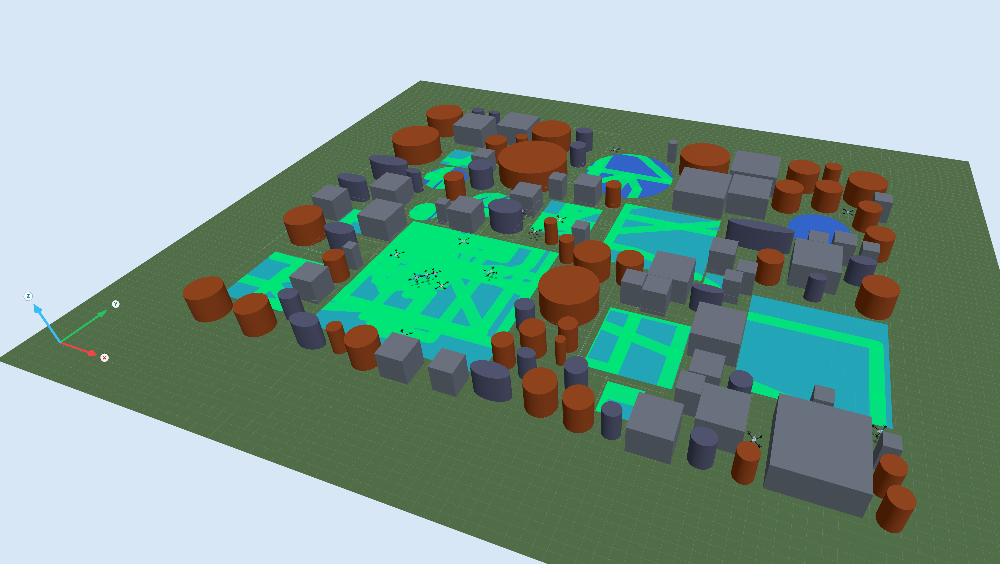

# MultiUAV-Plat 🚁

**An LLM-Oriented Platform, Benchmark and Framework for Multi-UAV Collaborative Task Planning**

🌐 Language: **English** | [中文](README_CN.md)

[📄 Paper](https://arxiv.org/abs/2606.31073) | [🏠 Project Website](https://zhangsheng93.github.io/multiuavweb/) | [💻 Code](https://github.com/zhangsheng93/MultiUAV-Plat) | [📦 Benchmark](https://github.com/zhangsheng93/MultiUAV-Plat/releases) | [⬇️ Releases](https://github.com/zhangsheng93/MultiUAV-Plat/releases) | [📝 Citation](#-citation)

MultiUAV-Plat is a lightweight, open-source simulation platform and benchmark for studying LLM agents that plan, act, observe, and verify multi-UAV missions through restricted APIs and partial local perception.

| Mission sessions | Natural-language tasks | Validation checks |
| --- | --- | --- |
| 75 | 1500 | 9396 |

<table>
  <tr>
    <th width="50%">2D overview view</th>
    <th width="50%">3D visualization view</th>
  </tr>
  <tr>
    <td width="50%"></td>
    <td width="50%"></td>
  </tr>
</table>

## ✨ Overview

Large language models provide a promising interface for high-level robotic task planning, but evaluating them in multi-UAV collaboration is difficult. Existing UAV simulators mainly emphasize dynamics, perception, or low-level control, while LLM-agent evaluation needs a mission-level interface with restricted APIs, role-based information access, partial observations, hidden validation logic, and closed-loop execution.

For paper resources, visual summaries, downloads, and leaderboard updates, visit the [MultiUAV-Plat project website](https://zhangsheng93.github.io/multiuavweb/).

MultiUAV-Plat addresses this gap with three main research contributions:

- **MultiUAV-Plat platform**: a RESTful multi-UAV simulation environment with agent-facing observations, role-based access, session management, and optional 2D/3D visualization.
- **MultiUAV-Plat Benchmark**: a reproducible benchmark of executable multi-UAV missions with natural-language tasks and hidden validation checks.
- **MultiUAV-Agent Workflow**: a task-specific workflow for multi-UAV planning, execution, verification, and replanning, implemented in this repository as Agent4Drone.

The public repository also includes **MultiUAV-Plat Web 3D Viewer**, a standalone Three.js/Vite viewer for live mission visualization, contributed by [@Damonhellokitty](https://github.com/Damonhellokitty).

## 🧭 Key Features

- 🛰️ RESTful APIs for mission-level UAV control, sensing, session management, and validation.
- 🔐 Role-based access control and agent-facing observations that prevent privileged simulator access.
- ✅ Hidden task validators for reproducible closed-loop evaluation.
- 🗺️ 2D and 3D visualization: 2D views support fast mission overview and scenario editing, while the 3D viewer provides immersive inspection of UAV trajectories, altitude, coverage, targets, and obstacles.
- 🎛️ GUI controller for session creation, editing, import/export, and monitoring.
- 🤖 MultiUAV-Agent Workflow covering observation, memory, task understanding, planning, execution, verification, and replanning, with Agent4Drone as the reference implementation.
- 📊 Benchmark scenarios covering Target Assignment, Area Search, and Area Assignment and Patrol.

## 📁 Repository Layout

```text
server/       Main simulation server and REST API
controller/   GUI/session controller
agent4drone/  LLM-based UAV agent framework and agent API service
benchmark/    Benchmark sessions and scenario assets
view3d/       Web-based 3D mission visualization viewer
```

Each component includes its own documentation for deeper usage details.

## ⬇️ Releases

Prebuilt binary packages are available from [GitHub Releases](https://github.com/zhangsheng93/MultiUAV-Plat/releases) for users who want to run the platform without installing the source-code dependencies. Release packages include separate executables for the simulation server and the GUI controller, plus the bundled documentation and session assets.

Start the server first, then start the controller.

| System | Package | How to run |
| --- | --- | --- |
| Windows | `MultiUAV-Plat-v0.40_Windows.zip` | Double-click `MultiUAV-Plat.Server.v0.40.exe`, then double-click `MultiUAV-Plat.Controller.v0.40.exe`. |
| macOS | `MultiUAV-Plat-v0.40_Mac.zip` | Double-click the executables, or run them from Terminal with `./MultiUAV-Plat.Server.v0.40` and `./MultiUAV-Plat.Controller.v0.40`. |
| Linux | Linux release package | Run the server and controller executables from a shell, following the same server-first order. |

For macOS/Linux shell execution, you may need to add executable permission first:

```bash
chmod +x MultiUAV-Plat.Server.v0.40 MultiUAV-Plat.Controller.v0.40
./MultiUAV-Plat.Server.v0.40
./MultiUAV-Plat.Controller.v0.40
```

The source-code workflow below is recommended for development, customization, and reproducing experiments from the repository.

## 🚀 Quick Start (from Source)

### 1. Start the simulation server

For full server setup, UI options, API groups, and troubleshooting, see the [server README](server/README.md).

```bash
cd server
pip install -r requirements.txt
python main.py
```

Default endpoints:

- Server API: `http://127.0.0.1:8000`
- Server docs: `http://127.0.0.1:8000/docs`

Useful server documentation:

- [API Documentation](server/docs/API_DOCUMENTATION.md): full endpoint guide and examples.
- [API Reference](server/docs/API_REFERENCE.md): detailed route-level reference.
- [Authentication](server/docs/AUTHENTICATION.md): roles, API-key usage, and access model.
- [Agent API Guide](server/docs/API_AGENT_GUIDE.md): agent-facing usage patterns and constraints.
- [Task Template Edit Guide](server/docs/TASK_TEMPLATE_EDIT_GUIDE.md): task/session template authoring guide.
- [Changelog](server/docs/CHANGELOG.md): notable API and platform updates.

### 2. Launch the GUI controller

For the session manager workflow, GUI tabs, import/export behavior, and controller troubleshooting, see the [controller README](controller/README.md).

```bash
cd controller
pip install -r requirements.txt
python main.py
```

The controller connects to the local server and provides session management, scenario editing, import/export, and monitoring tools.

### 3. Launch the Web 3D viewer (optional)

Start the simulation server first. For viewer setup, backend mode, demo mode, configuration, build, and test details, see the [view3d README](view3d/README.md).

```bash
cd view3d
npm install
npm run dev
```

Default viewer URL:

- Web 3D Viewer: `http://127.0.0.1:5173`

`npm run dev` reads live mission data from the local server through `GET /sessions/current/data`. For frontend-only demo mode without a running server, use:

```bash
npm run dev:demo
```

### 4. Run Agent4Drone

Agent4Drone calls an external LLM backend, so you need to provide your own model-provider API key before starting it. You can either edit `llm_settings.json` locally or export an environment variable such as `OPENAI_API_KEY` or `LLM_API_KEY`.

```bash
cd agent4drone
cp llm_settings.example.json llm_settings.json
# Add your own LLM API key in llm_settings.json, or export OPENAI_API_KEY / LLM_API_KEY.
```

Agent4Drone can be used in two modes:

**Option A: interactive agent UI**

Use this mode when you want to run Agent4Drone through its local interactive interface.

```bash
python main.py
```

**Option B: background agent API service**

Use this mode when another application, script, or controller should call Agent4Drone through HTTP.

```bash
python agent_api_service.py
```

Default service endpoints:

- Agent API: `http://localhost:18000`
- Agent docs: `http://localhost:18000/docs`

In service mode, agent commands can be submitted synchronously or through the asynchronous job API. See `agent4drone/README_SERVICE.md` and `agent4drone/README_API.md` for details.

## 📦 Benchmark

The MultiUAV-Plat Benchmark evaluates whether agents can interpret natural-language objectives, choose UAVs, collect missing information, execute valid API actions, coordinate multiple vehicles, and satisfy hidden mission-level checks.

The benchmark contains:

- 75 mission sessions
- 1500 natural-language tasks
- 9396 validation checks
- 3 scenario families: Target Assignment, Area Search, and Area Assignment and Patrol
- 5 difficulty levels: Easy, Intermediate, Moderate, Hard, and Extreme

Benchmark sessions pair structured JSON scenario data with visual assets. Agents are expected to solve tasks through platform API interaction rather than direct access to privileged simulator state or hidden validator definitions.

## 🏆 Results

The following full-benchmark results are computed on 75 sessions, 1500 tasks, and 9396 validation checks. The **Backend LLM** column identifies the model used by each agent run.

| Method | Backend LLM | Passed Tasks | Fully Failed Tasks | Task Pass | Avg. Check | Global Check | Total Failed |
| --- | --- | ---: | ---: | ---: | ---: | ---: | ---: |
| Agent4Drone | DeepSeek V4 Pro | **1054 / 1500** | **93 / 1500** | **70.27%** | **84.86%** | **82.82%** | **6.20%** |
| Agent4Drone | DeepSeek V4 Flash | 1044 / 1500 | 102 / 1500 | 69.60% | 83.40% | 80.76% | 6.80% |
| ReAct | DeepSeek V4 Pro | 954 / 1500 | 118 / 1500 | 63.60% | 79.72% | 73.09% | 7.87% |
| Agent4Drone | doubao-2-pro | 869 / 1500 | 194 / 1500 | 57.93% | 74.58% | 71.96% | 12.93% |
| ReAct | qwen3.5 | 629 / 1500 | 333 / 1500 | 41.93% | 59.42% | 56.29% | 22.20% |
| ReAct | doubao-2-pro | 459 / 1500 | 486 / 1500 | 30.60% | 47.91% | 43.15% | 32.40% |

In the paired doubao-2-pro comparison, Agent4Drone improves task pass rate by **+27.33 percentage points** over the ReAct baseline and reduces fully failed tasks from **32.40%** to **12.93%**. With stronger DeepSeek backends, Agent4Drone reaches a **70.27%** task pass rate and an **82.82%** global check pass rate. Detailed scenario-level and difficulty-level analyses are reported in the paper and project materials.

## 📝 Citation

If you use MultiUAV-Plat, MultiUAV-Plat Benchmark, or Agent4Drone in your research, please cite the arXiv preprint.

```bibtex
@article{zhang2026multiuavplat,
  title         = {MultiUAV-Plat: An LLM-Oriented Platform, Benchmark and Framework for Multi-UAV Collaborative Task Planning},
  author        = {Zhang, Sheng and Li, Qinglin and Zang, Yuechao and Huang, Xueqin and Fu, Yijia and Zhu, Cheng},
  journal       = {arXiv preprint arXiv:2606.31073},
  year          = {2026},
  eprint        = {2606.31073},
  archivePrefix = {arXiv},
  url           = {https://arxiv.org/abs/2606.31073}
}
```

## 📜 License and Acknowledgements

This project is released under the license in [LICENSE](LICENSE).
