# MultiUAV-Plat Tutorial

**Version:** v0.4

**Date:** 2026-7-2

# Starting the System

The system consists of a server and a controller. The server is the main platform endpoint; the controller is the manual control endpoint and can serve as a development reference. Development should be built on top of the server.

## 1.1 UAV Simulation System

Launch `MultiUAV-Plat.Server.exe`. A command prompt window appears.

<p align="center">
  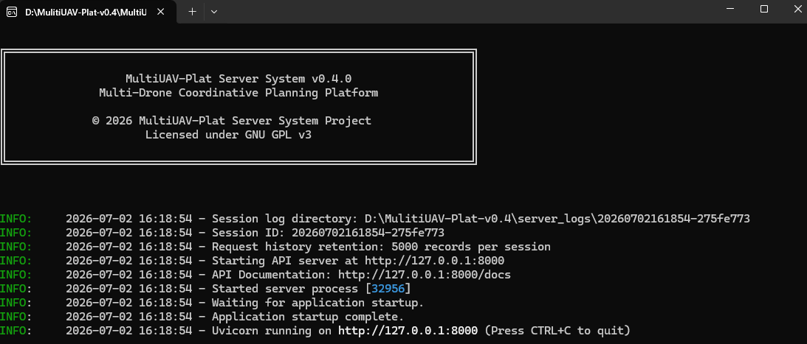
</p>

<p align="center"><em>Figure 1.1-1 Command prompt window after starting server</em></p>

At this point the **REST API server is already running in the background** (default address `http://127.0.0.1:8000`). A dialog then appears asking whether to open the graphical interface.

<p align="center">
  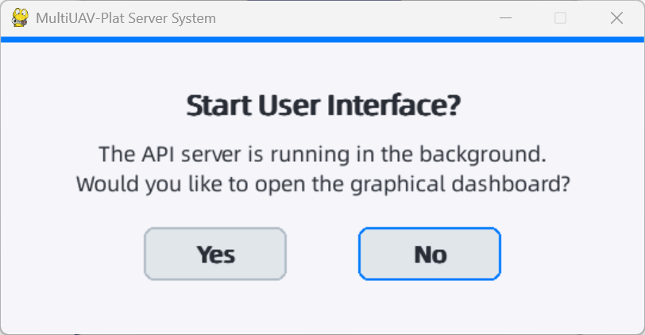
</p>

<p align="center"><em>Figure 1.1-2 Dialog asking whether to start the graphical interface</em></p>

The dialog shows: `The API server is running in the background.` and asks `Would you like to open the graphical dashboard?`

| Option | Effect |
| --- | --- |
| **Yes** | Keeps the API server running and additionally opens the **2D graphical interface** (Pygame simulation dashboard) for visual monitoring and some manual operations |
| **No** | **Keeps only the API server** without starting the graphical interface; the command prompt window stays open and shows messages such as `API server running in background. Press Ctrl+C to stop.` |
| **Close (×)** | Cancels startup and exits the program |

If you choose **No**, the platform still runs in **API-only mode**. External programs such as the Controller, 3D viewer, and agent service can connect to `http://127.0.0.1:8000` for development and testing; the 2D visualization window shown in Figure 1.1-3 simply does not appear. This is suitable when you only need the API and not the local GUI.

After choosing **Yes**, the graphical interface appears as shown below.

<p align="center">
  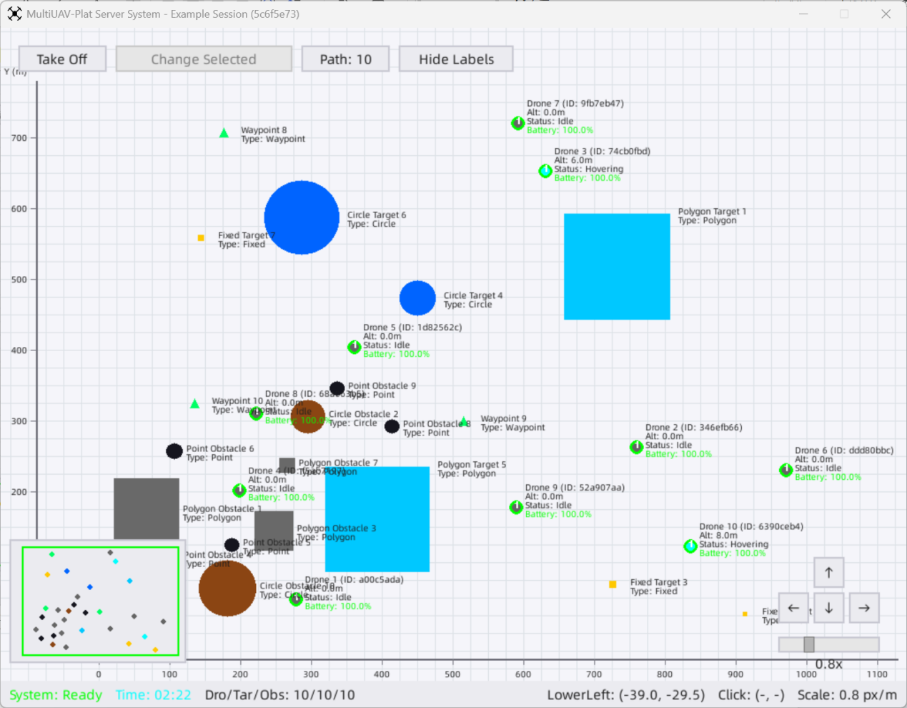
</p>

<p align="center"><em>Figure 1.1-3 Graphical interface (opened after choosing Yes)</em></p>

UAV simulation system started successfully!

## 1.2 UAV Control System

Launch `MultiUAV-Plat.Controller.exe`. A command prompt window and a session management window appear.

<p align="center">
  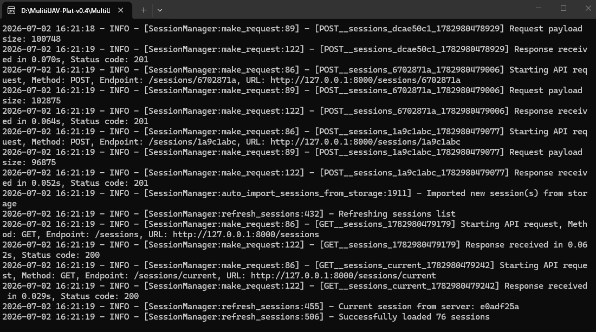
</p>

<p align="center"><em>Figure 1.2-1 Controller command prompt window</em></p>

<p align="center">
  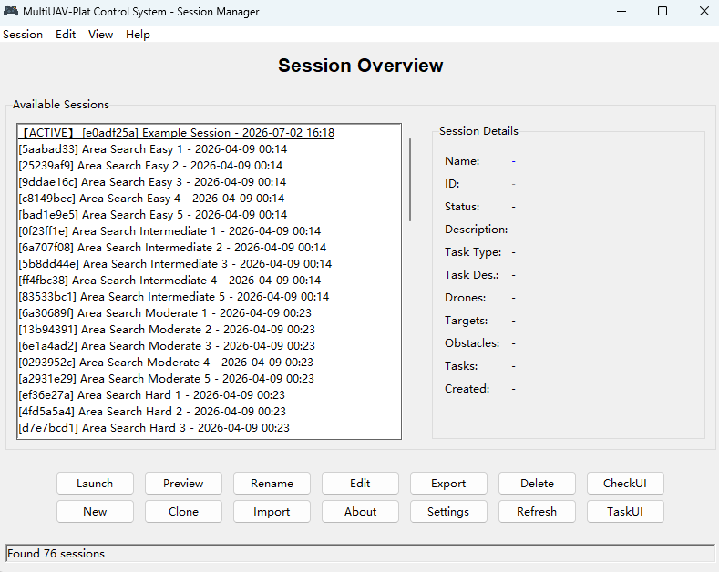
</p>

<p align="center"><em>Figure 1.2-2 Session management window</em></p>

UAV control system started successfully!

# 2. Editing the Overall Session

## 2.1 Creating a Session

In the session management window, click the "New" button to open the new session creation screen.

<p align="center">
  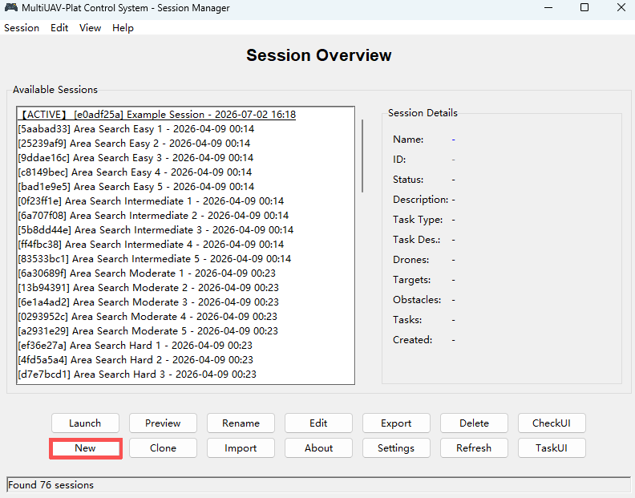
</p>

<p align="center"><em>Figure 2.1-1 Clicking the New button to start session creation</em></p>

The new session creation screen is shown below.

<p align="center">
  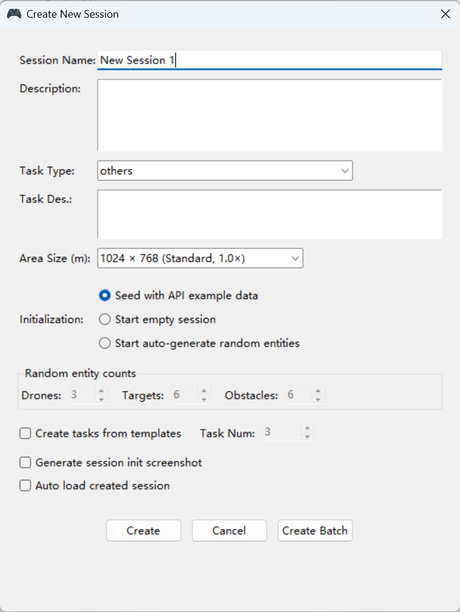
</p>

<p align="center"><em>Figure 2.1-2 New session creation screen</em></p>

**Session Name:** Session name

**Description:** Session description

**Task Type:** Task type (5 options).

| Name | Meaning |
| --- | --- |
| area_search | Area search |
| area_assignment_and_patrol | Area assignment and patrol |
| target_assignment | Target assignment |
| target_tracking | Target tracking |
| others | Others |

**Task Des.:** Task description

**Area Size:** Area size — Width and Height

**Initialization:** Initialization mode (3 options).

| Name | Meaning |
| --- | --- |
| Seed with example data | Create session with example data |
| Start empty session | Create empty session |
| Start auto-generate random entities | Create session with random entities |

After selecting "Start auto-generate random entities", specify the number of randomly generated drones, targets, and obstacles. The session will then contain the specified counts of these three entity types.

**Generate session init screenshot:** Show the graphical interface of the newly created session

**Create tasks from templates:** Create tasks from templates; when selected, specify Task Num

**Auto load created session:** Automatically load the created session

**Create:** Create session

**Create Batch:** Batch-create sessions. A dialog opens to enter how many sessions to create.

<p align="center">
  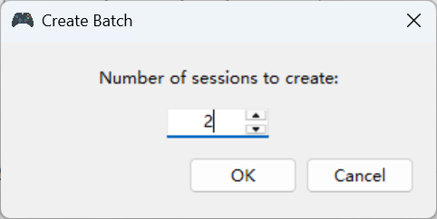
</p>

<p align="center"><em>Figure 2.1-3 Batch session creation dialog</em></p>

The example below uses "Start empty session" to create a blank session, shown as "New Session 1" in the figure.

<p align="center">
  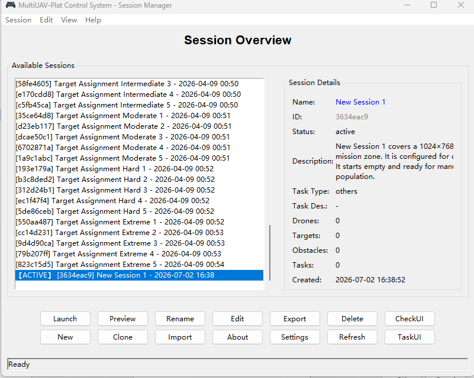
</p>

<p align="center"><em>Figure 2.1-4 Successfully created blank session New Session 1</em></p>

Session created successfully!

## 2.2 Opening a Session

Select the newly created "New Session 1" and click "Launch" to open the session.

<p align="center">
  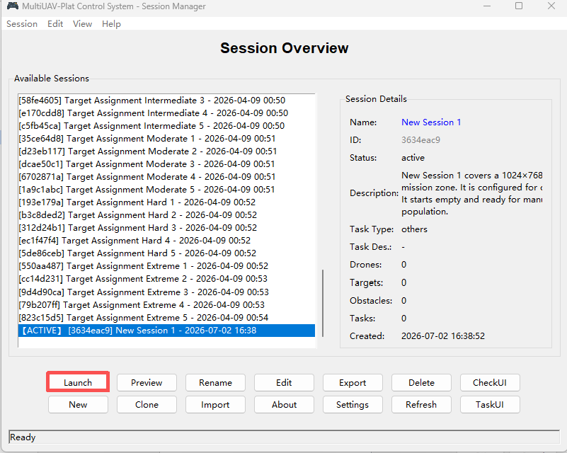
</p>

<p align="center"><em>Figure 2.2-1 Selecting a session and clicking the Launch button</em></p>

After opening the session, the console appears. Click **View Full Data** to open the **Session Data** dialog, which shows the session's basic information and entity lists in a structured layout.

<p align="center">
  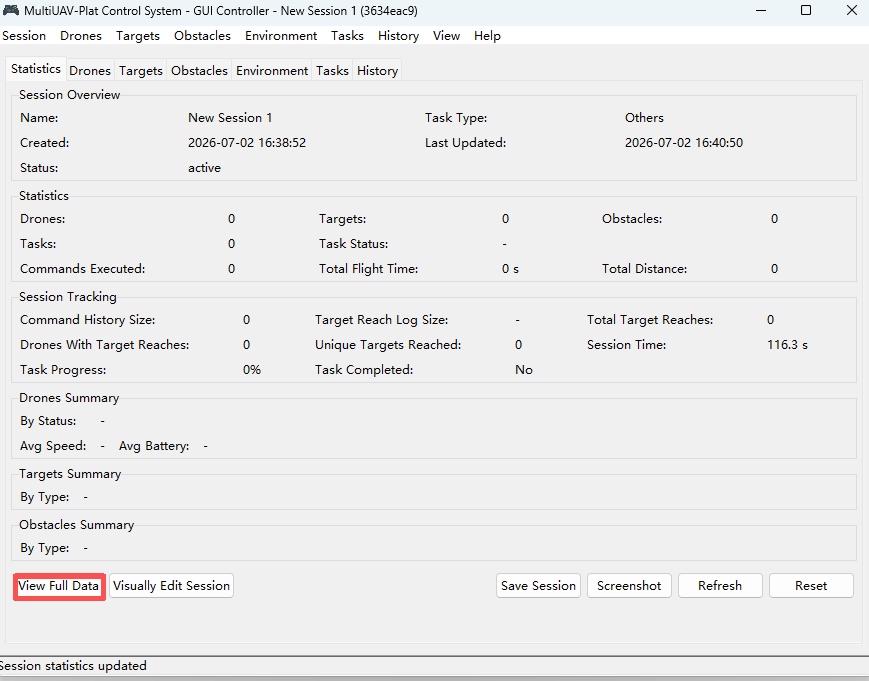
</p>

<p align="center"><em>Figure 2.2-2 Console interface and the View Full Data button</em></p>

In the lower-right corner of that dialog, click **View Raw Data** to open a **Session Data - Raw Data** window. It displays the session's **complete raw data** as syntax-highlighted JSON for verification or copying. The window provides **Copy** (copy all JSON) and **Close** buttons at the bottom.

Typical fields include:

| Category | Example fields | Description |
| --- | --- | --- |
| Session identity | `id`, `name`, `description`, `status`, `creator` | Session ID, name, description, run status, and creator |
| Task info | `task_type`, `task_description` | Task type and description |
| Canvas settings | `canvas_width`, `canvas_height`, `is_distance_3d` | Simulation canvas size and distance calculation mode |
| Timestamps | `created_at`, `last_updated` | Creation and last update times (Unix timestamps) |
| Statistics | `statistics.drone_count`, `target_count`, `obstacle_count`, etc. | Drone, target, and obstacle counts plus cumulative flight data |

<p align="center">
  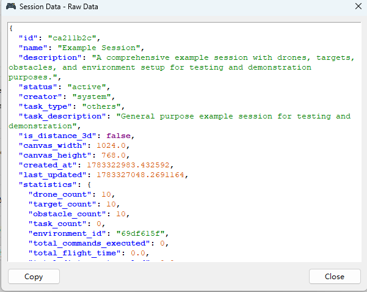
</p>

<p align="center"><em>Figure 2.2-3 Complete JSON raw data shown after clicking View Raw Data</em></p>

In the simulation system GUI opened earlier, the view updates to the selected blank session.

<p align="center">
  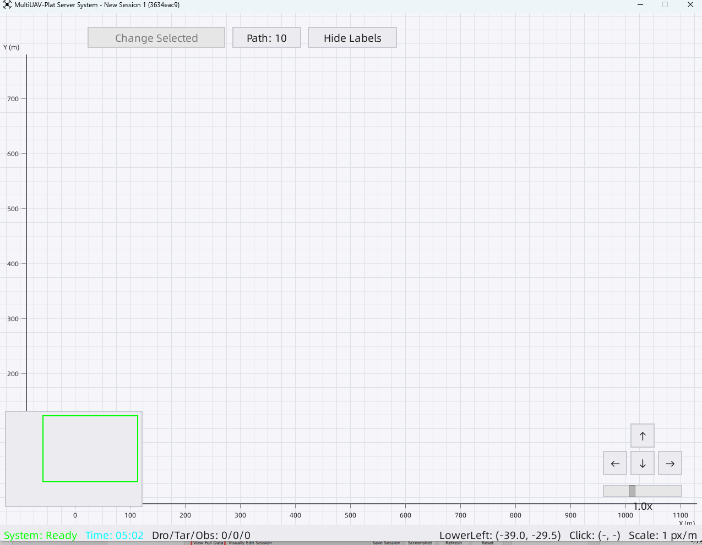
</p>

<p align="center"><em>Figure 2.2-4 Simulation system updated to the selected blank session</em></p>

Session opened successfully!

## 2.3 Exporting a Session

Select "New Session 1" and click "Export". The session is saved locally as a JSON file.

<p align="center">
  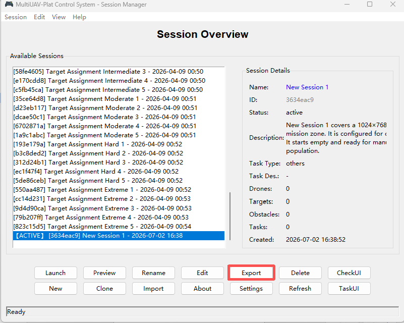
</p>

<p align="center"><em>Figure 2.3-1 Clicking the Export button to export the session</em></p>

## 2.4 Deleting a Session

Select "New Session 1" and click "Delete".

<p align="center">
  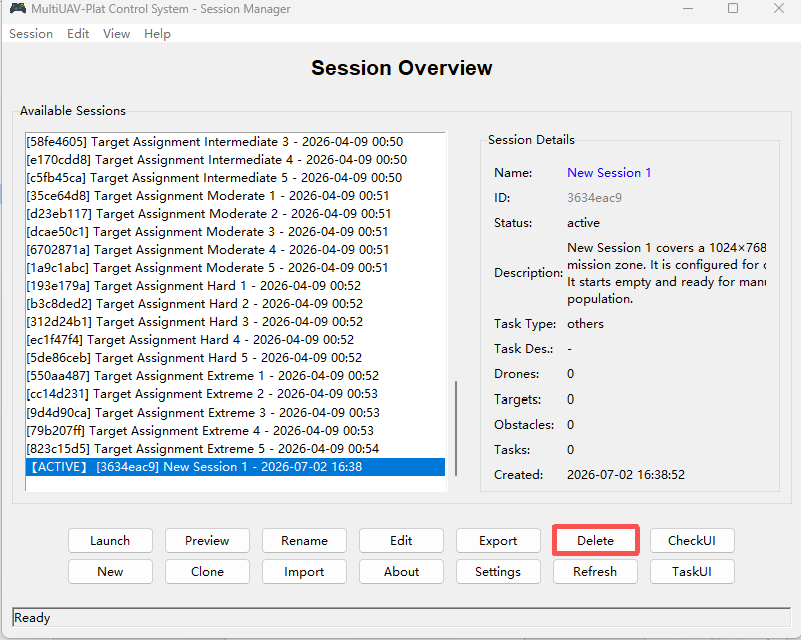
</p>

<p align="center"><em>Figure 2.4-1 The Delete button for removing a session</em></p>

A confirmation dialog appears. Click "Yes" to delete the session.

<p align="center">
  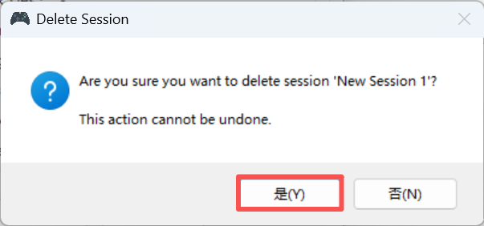
</p>

<p align="center"><em>Figure 2.4-2 Session deletion confirmation dialog</em></p>

# 3. Modifying Session Content

Open a session. The console has four tabs: Drones, Targets, Obstacles, and Environments. These are the editable elements of a session.

<p align="center">
  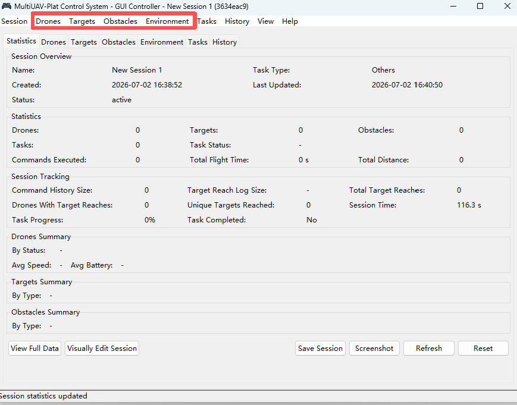
</p>

<p align="center"><em>Figure 3-1 The four console tabs</em></p>

## 3.1 Drones

### 3.1.1 Add

Open the "Drones" tab and click "Add".

<p align="center">
  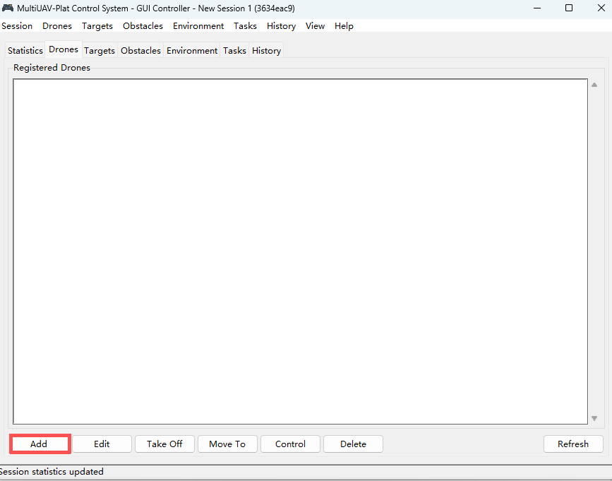
</p>

<p align="center"><em>Figure 3.1.1-1 The Drones tab and the Add button</em></p>

The add-drone dialog appears.

<p align="center">
  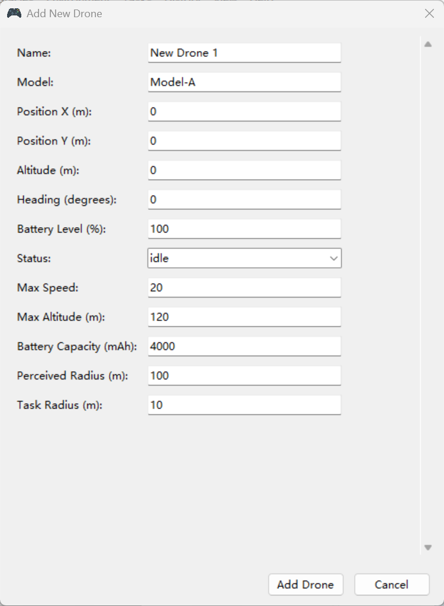
</p>

<p align="center"><em>Figure 3.1.1-2 Add-drone dialog</em></p>

**Name:** Name

**Model:** Simulation model

**Position X/Y:** Horizontal coordinates

**Altitude:** Altitude

**Heading:** Heading angle; 0 is north, increasing clockwise.

**Battery Level:** Battery percentage

**Status:** Status (4 options).

| Name | Meaning |
| --- | --- |
| idle | Idle |
| hovering | Hovering |
| emergency | Emergency |
| offline | Offline |

**Max Speed:** Maximum speed

**Max Altitude:** Maximum altitude

**Battery Capacity:** Battery capacity

**Perceived Radius:** Detection radius

**Task Radius:** Task radius

Click "Add Drone" to add the drone.

### 3.1.2 Edit

Select a drone and click "Edit".

<p align="center">
  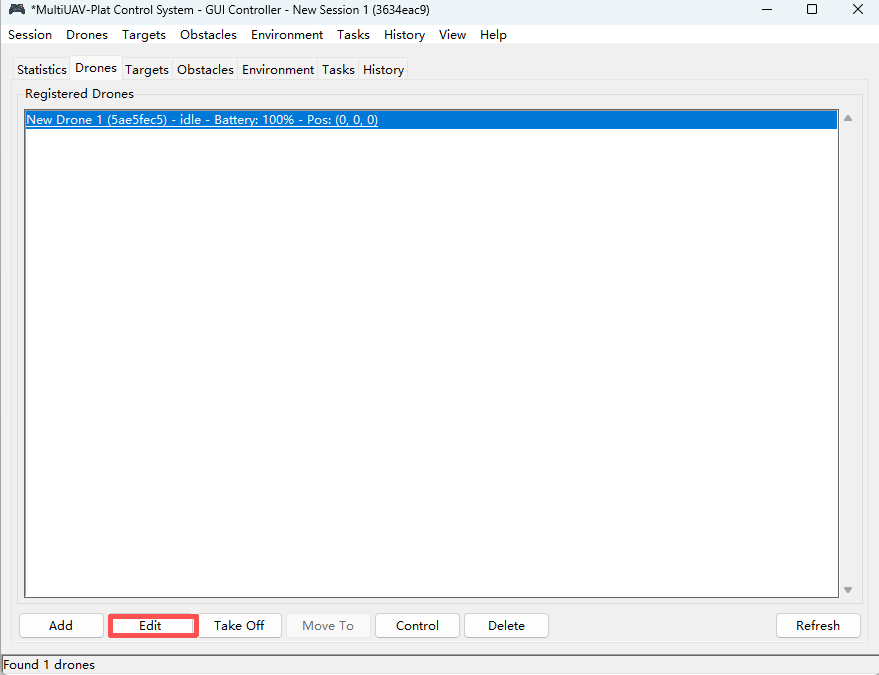
</p>

<p align="center"><em>Figure 3.1.2-1 Selecting a drone and clicking the Edit button</em></p>

The edit-drone dialog appears with the same fields as add-drone. Click "Save Changes" to save.

<p align="center">
  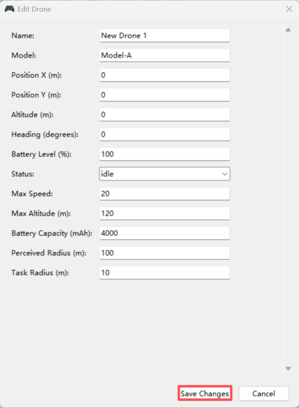
</p>

<p align="center"><em>Figure 3.1.2-2 Edit-drone dialog</em></p>

### 3.1.3 Delete

Select a drone and click "Delete".

<p align="center">
  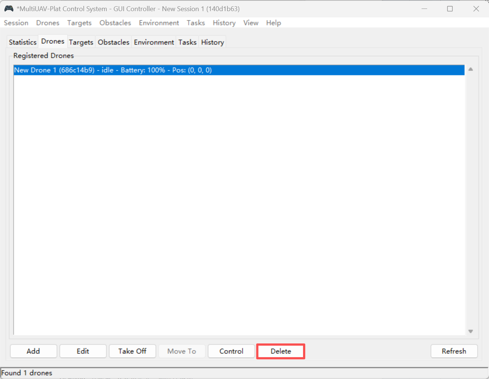
</p>

<p align="center"><em>Figure 3.1.3-1 Selecting a drone and clicking the Delete button</em></p>

The delete confirmation appears. Click "Delete" to remove the drone.

<p align="center">
  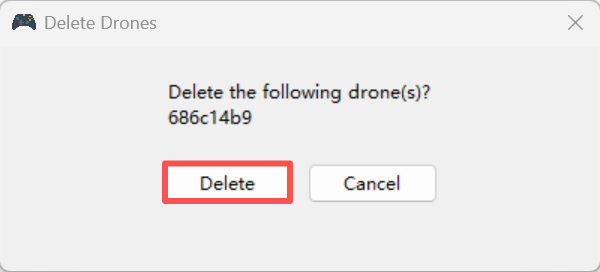
</p>

<p align="center"><em>Figure 3.1.3-2 Delete-drone dialog</em></p>

## 3.2 Targets

Targets come in five types: Waypoint, Moving, Fixed, Circle, and Polygon. An example simulation GUI is shown below.

<p align="center">
  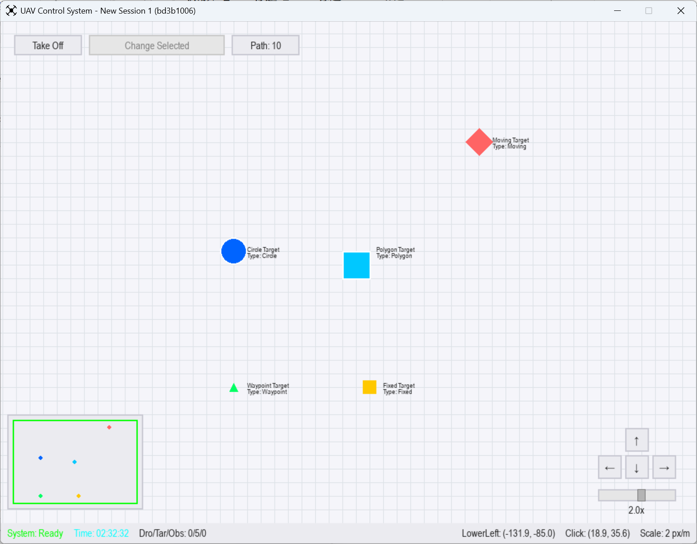
</p>

<p align="center"><em>Figure 3.2-1 Display of the five target types</em></p>

Green = waypoint, red = moving, yellow = fixed, dark blue = circle, light blue = polygon. Edit and delete work like drones and are omitted here. Below are the add flows for each target type.

### 3.2.1 Waypoint Targets (Charging Stations)

Open the "Targets" tab and click "+Waypoint".

<p align="center">
  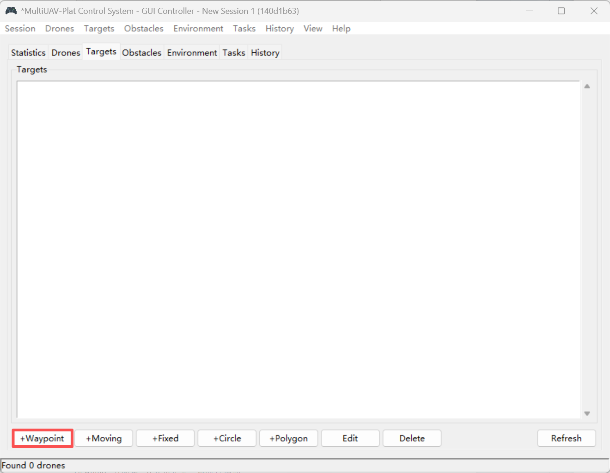
</p>

<p align="center"><em>Figure 3.2.1-1 The Target tab and the +Waypoint button</em></p>

The add-waypoint dialog appears.

<p align="center">
  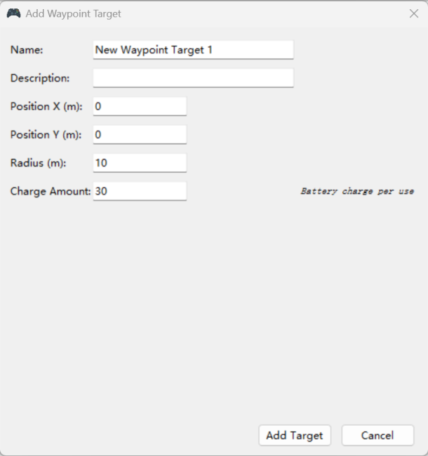
</p>

<p align="center"><em>Figure 3.2.1-2 Waypoint target information</em></p>

**Name:** Name

**Description:** Description

**Position X/Y:** Position

**Radius:** Radius

**Charge Amount:** Charge capacity

Click "Add Target" to add the waypoint.

### 3.2.2 Moving Targets

Click "+Moving".

<p align="center">
  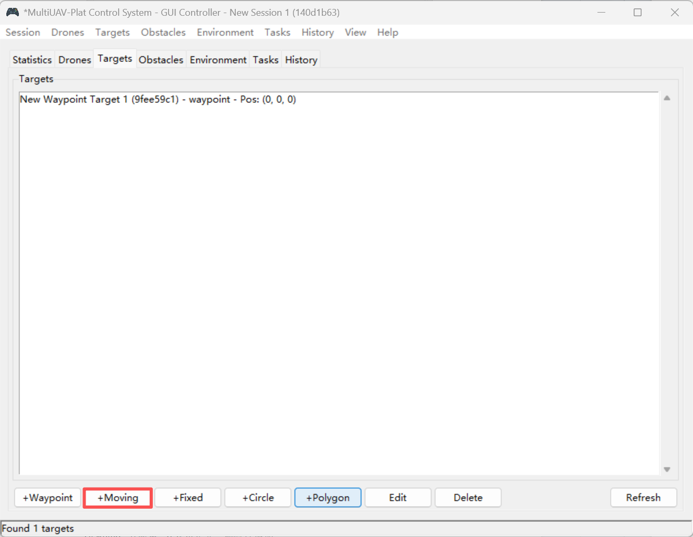
</p>

<p align="center"><em>Figure 3.2.2-1 Clicking the +Moving button</em></p>

The add-moving-target dialog appears.

<p align="center">
  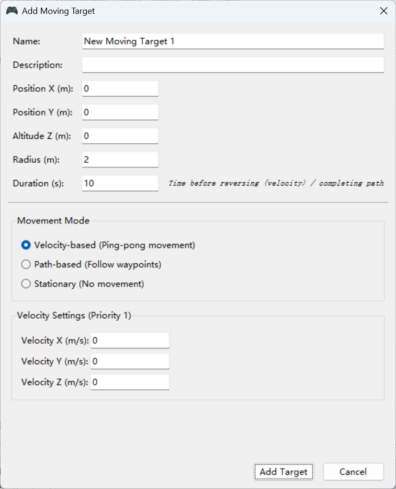
</p>

<p align="center"><em>Figure 3.2.2-2 Add-moving-target dialog</em></p>

**Velocity X/Y/Z:** Velocity in three dimensions

**Duration:** Total movement duration

**Movement Mode:** Movement mode (3 options)

| Name | Meaning |
| --- | --- |
| Velocity-based (Ping-pong movement) | Velocity-based ping-pong movement |
| Path-based (Follow waypoints) | Path-based waypoint following |
| Stationary (No movement) | Stationary (no movement) |

### 3.2.3 Fixed Targets

Click "+Fixed".

<p align="center">
  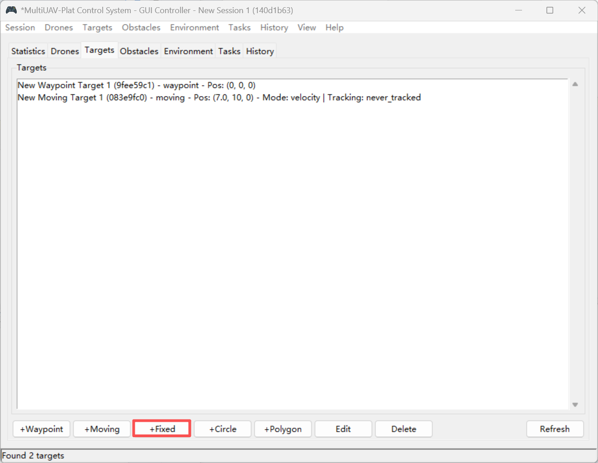
</p>

<p align="center"><em>Figure 3.2.3-1 Clicking the +Fixed button</em></p>

The add-fixed-target dialog appears.

<p align="center">
  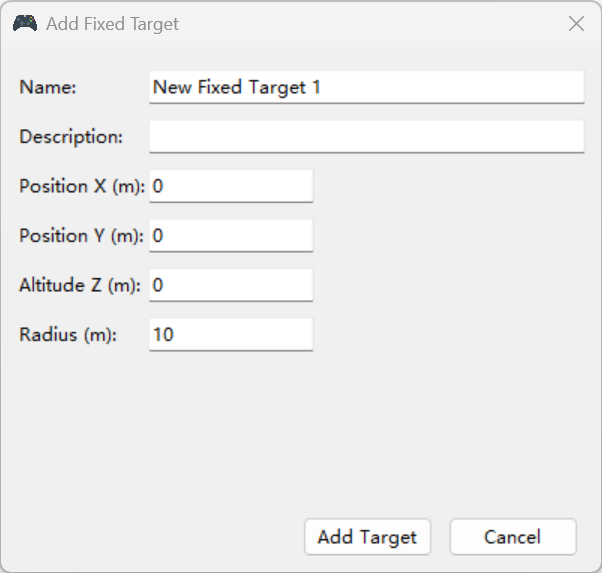
</p>

<p align="center"><em>Figure 3.2.3-2 Add-fixed-target dialog</em></p>

### 3.2.4 Circle Targets

Click "+Circle".

<p align="center">
  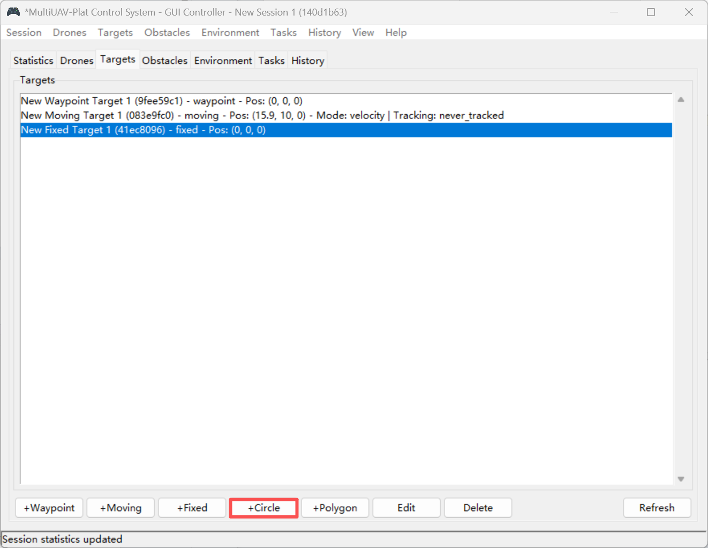
</p>

<p align="center"><em>Figure 3.2.4-1 Clicking the +Circle button</em></p>

The add-circle-target dialog appears.

<p align="center">
  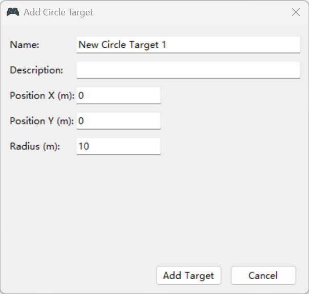
</p>

<p align="center"><em>Figure 3.2.4-2 Add-circle-target dialog</em></p>

### 3.2.5 Polygon Targets

Click "+Polygon".

<p align="center">
  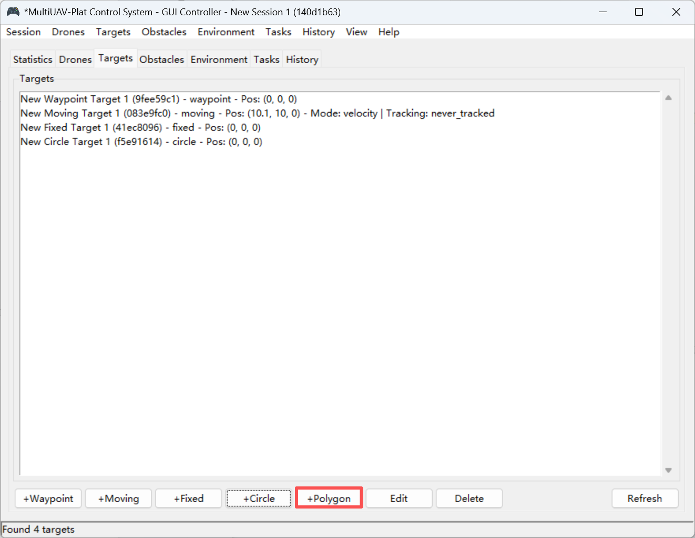
</p>

<p align="center"><em>Figure 3.2.5-1 Clicking the +Polygon button</em></p>

The add-polygon-target dialog appears.

<p align="center">
  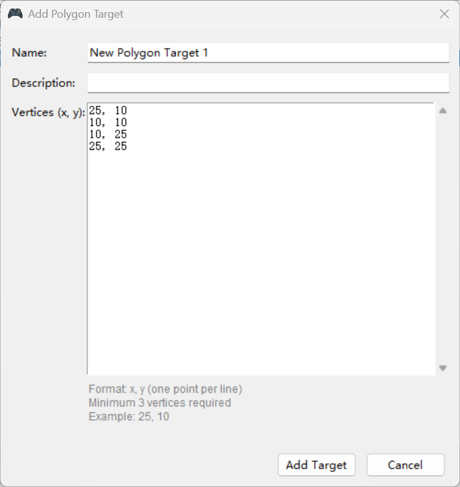
</p>

<p align="center"><em>Figure 3.2.5-2 Add-polygon-target dialog</em></p>

**Vertices:** Vertex X/Y coordinates; at least 3 rows (3 vertices) are required.

## 3.3 Obstacles

Obstacles come in four types: Point, Circle (cylinder), Ellipse, and Polygon. An example simulation GUI is shown below.

<p align="center">
  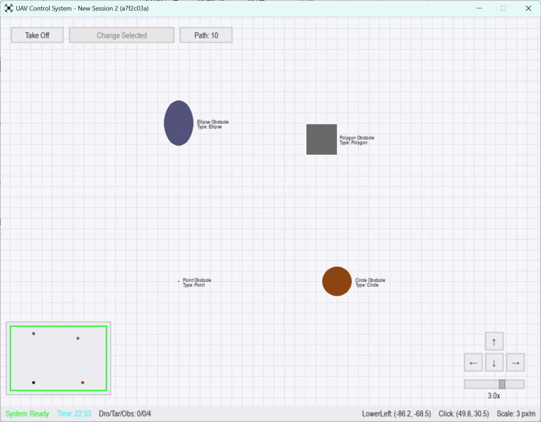
</p>

<p align="center"><em>Figure 3.3-1 Display of the four obstacle types</em></p>

Black = point, brown = cylinder, blue-gray = elliptic cylinder, gray = polyhedron. Edit and delete work like drones. Below are the add flows for each obstacle type.

### 3.3.1 Point Obstacles

Open the "Obstacles" tab and click "+Point".

<p align="center">
  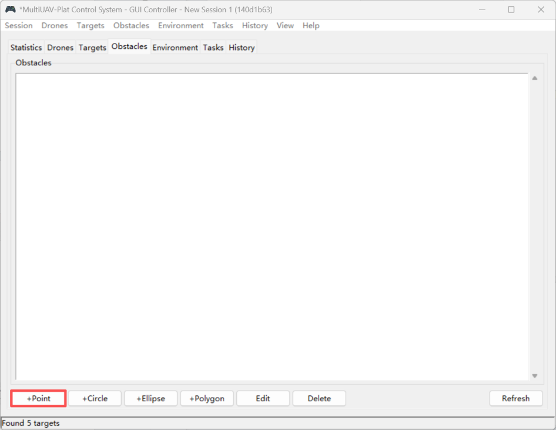
</p>

<p align="center"><em>Figure 3.3.1-1 The Obstacles tab and the +Point button</em></p>

The add-point-obstacle dialog appears.

<p align="center">
  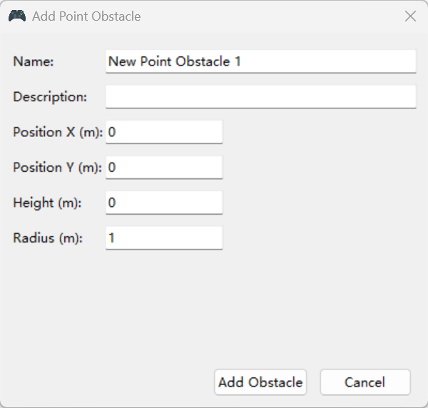
</p>

<p align="center"><em>Figure 3.3.1-2 Add-point-obstacle dialog</em></p>

**Name:** Name

**Description:** Description

**Position X/Y/Z:** Position

**Radius:** Radius

Click "Add Obstacle" to add the point obstacle.

### 3.3.2 Cylinder Obstacles

Click "+Circle".

<p align="center">
  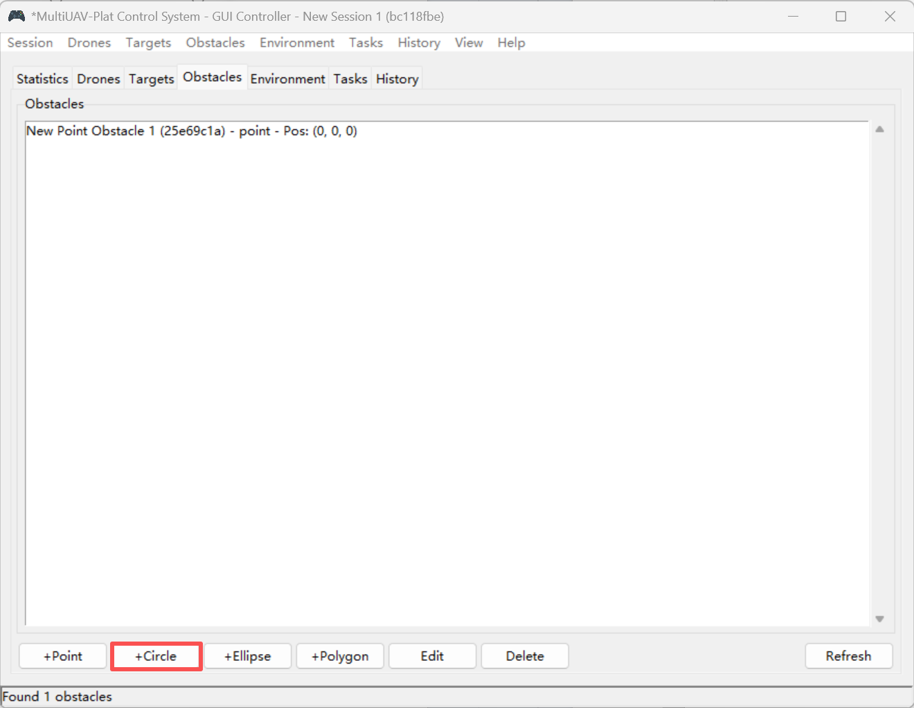
</p>

<p align="center"><em>Figure 3.3.2-1 Clicking the +Circle button</em></p>

The add-cylinder-obstacle dialog appears.

<p align="center">
  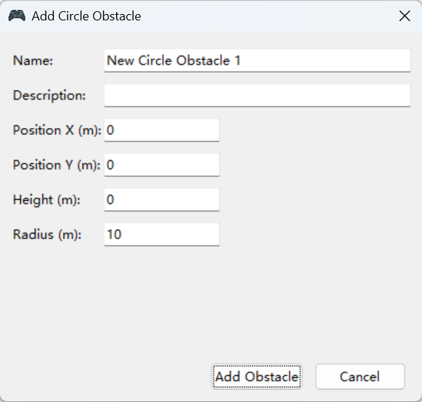
</p>

<p align="center"><em>Figure 3.3.2-2 Add-cylinder-obstacle dialog</em></p>

### 3.3.3 Elliptic Cylinder Obstacles

Click "+Ellipse".

<p align="center">
  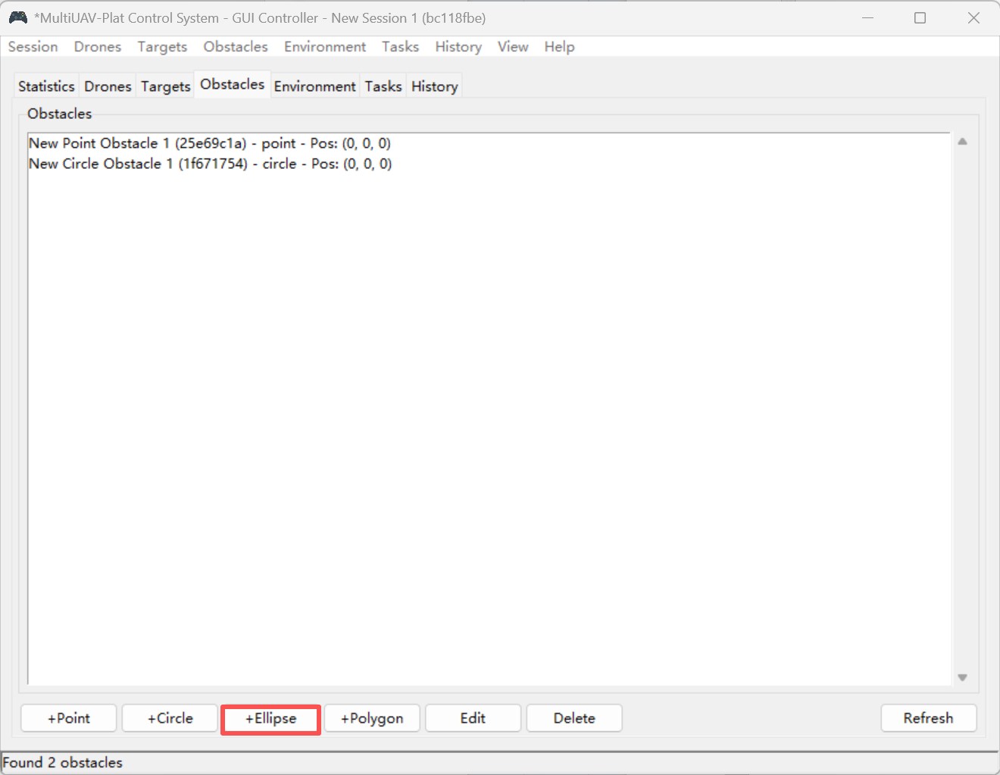
</p>

<p align="center"><em>Figure 3.3.3-1 Clicking the +Ellipse button</em></p>

The add-elliptic-cylinder dialog appears.

<p align="center">
  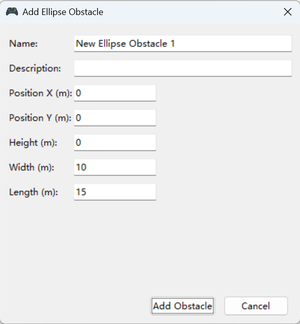
</p>

<p align="center"><em>Figure 3.3.3-2 Add-elliptic-cylinder dialog</em></p>

**Width:** Width

**Length:** Length

### 3.3.4 Polyhedron Obstacles

Click "+Polygon".

<p align="center">
  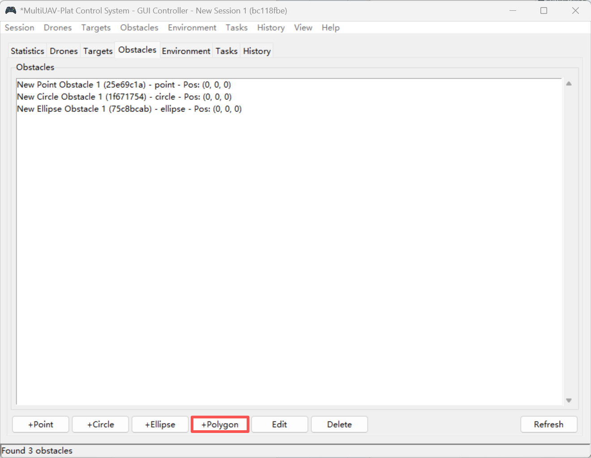
</p>

<p align="center"><em>Figure 3.3.4-1 Clicking the +Polygon button</em></p>

The add-polyhedron dialog appears.

<p align="center">
  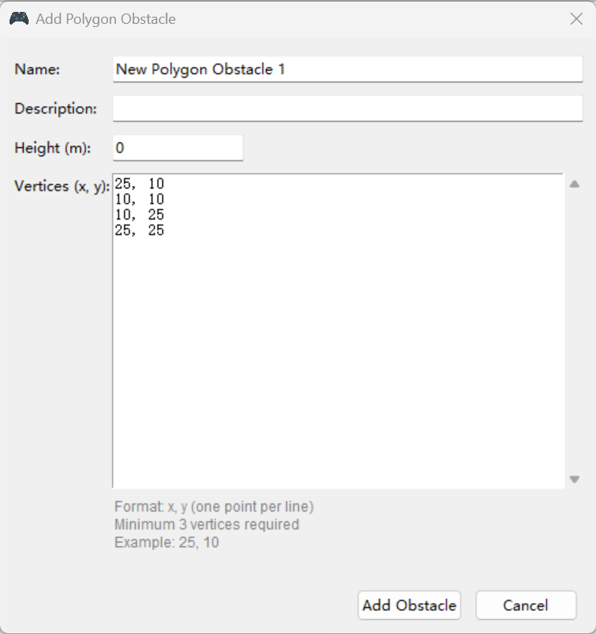
</p>

<p align="center"><em>Figure 3.3.4-2 Add-polyhedron dialog</em></p>

**Vertices:** Vertex X/Y coordinates; at least 3 rows for the base polygon.

## 3.4 Weather Environment

Edit and delete work like drones and are omitted. Below is the add flow for environments.

Open the "Environment" tab and click "Create Environment".

<p align="center">
  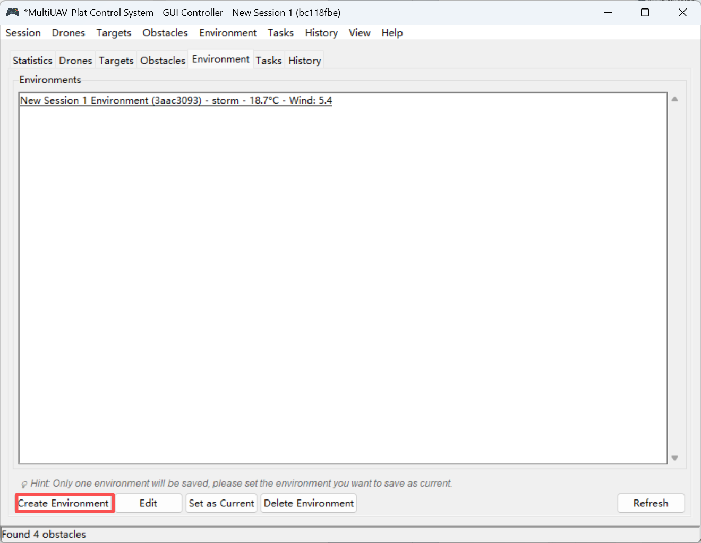
</p>

<p align="center"><em>Figure 3.4-1 The Environment tab and the Create Environment button</em></p>

The add-environment dialog appears.

<p align="center">
  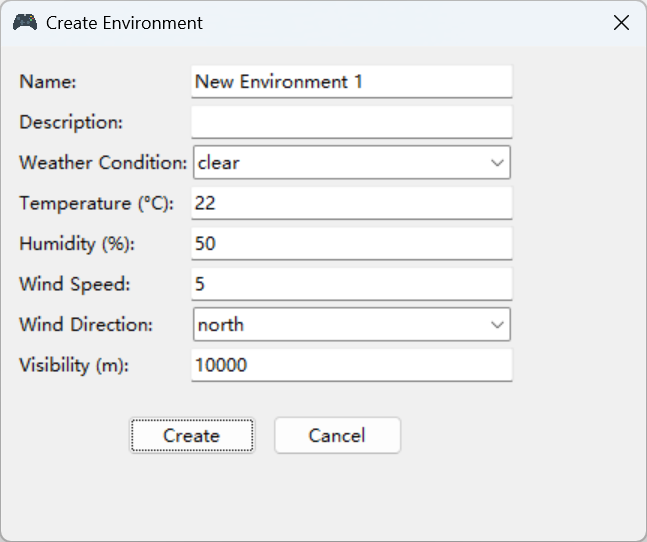
</p>

<p align="center"><em>Figure 3.4-2 Weather environment information</em></p>

**Name:** Name

**Description:** Description

**Weather Condition:** Weather condition (8 options).

| Name | Meaning |
| --- | --- |
| clear | Clear |
| cloudy | Cloudy |
| rainy | Rainy |
| storm | Storm |
| fog | Fog |
| snow | Snow |
| partly_cloudy | Partly cloudy |
| heavy_rain | Heavy rain |

**Temperature:** Temperature

**Humidity:** Humidity

**Wind Speed:** Wind speed

**Wind Direction:** Wind direction (8 options).

| Name | Meaning |
| --- | --- |
| north | North |
| northeast | Northeast |
| east | East |
| southeast | Southeast |
| south | South |
| southwest | Southwest |
| west | West |
| northwest | Northwest |

**Visibility:** Visibility

Click "Create" to add the environment. Back in the console, select it and click "Set as Current".

<p align="center">
  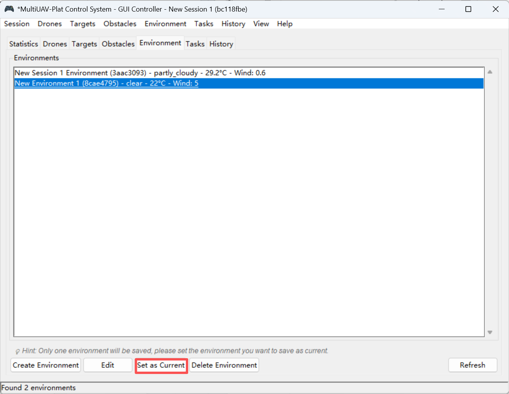
</p>

<p align="center"><em>Figure 3.4-3 Setting the current weather environment</em></p>

## 3.5 Visual Editing

Return to the console and click "Visually Edit Session".

<p align="center">
  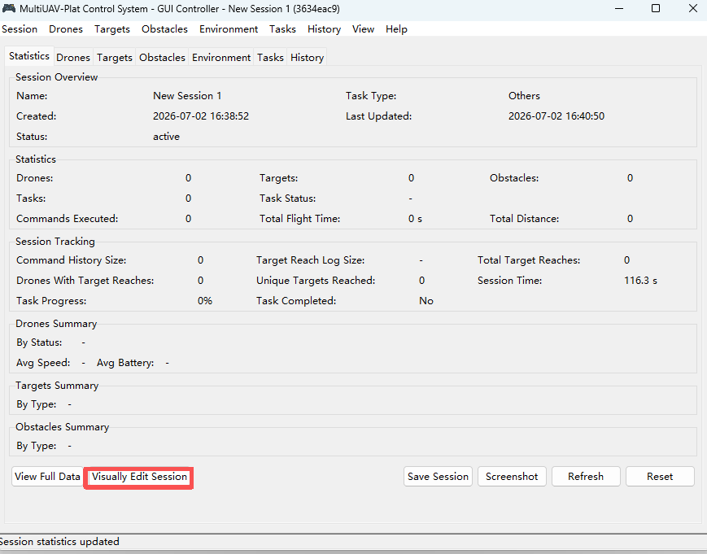
</p>

<p align="center"><em>Figure 3.5-1 Clicking the Visually Edit Session button</em></p>

The visual editor opens.

<p align="center">
  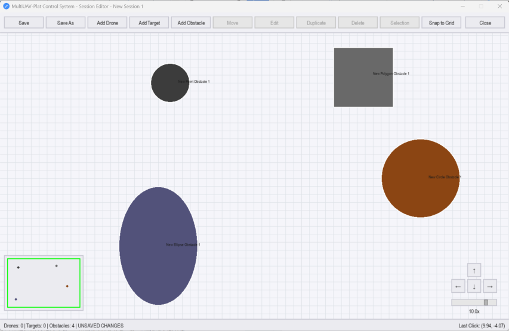
</p>

<p align="center"><em>Figure 3.5-2 Visual editor interface</em></p>

The visual editor provides "Add Drone", "Add Target", and "Add Obstacle". After selecting an entity:

| Button | Function |
| --- | --- |
| Move | Drag to move |
| Edit | Edit properties |
| Delete | Delete |
| Duplicate | Duplicate |

"Snap to Grid" enables grid snapping and works with "Move".

Use "Save" to save, "Save As" to save a copy, and "Close" to exit.

# 4. UAV Control

Drones can be controlled in two ways: through the simulation system or through the control system.

## 4.1 Simulation System

In the simulation GUI, click to select a drone.

<p align="center">
  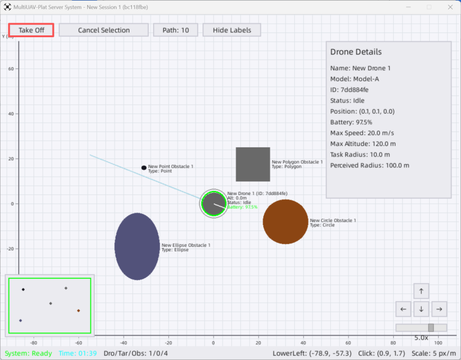
</p>

<p align="center"><em>Figure 4.1-1 Selecting a drone in the simulation system</em></p>

Click "Take Off" to launch the drone.

<p align="center">
  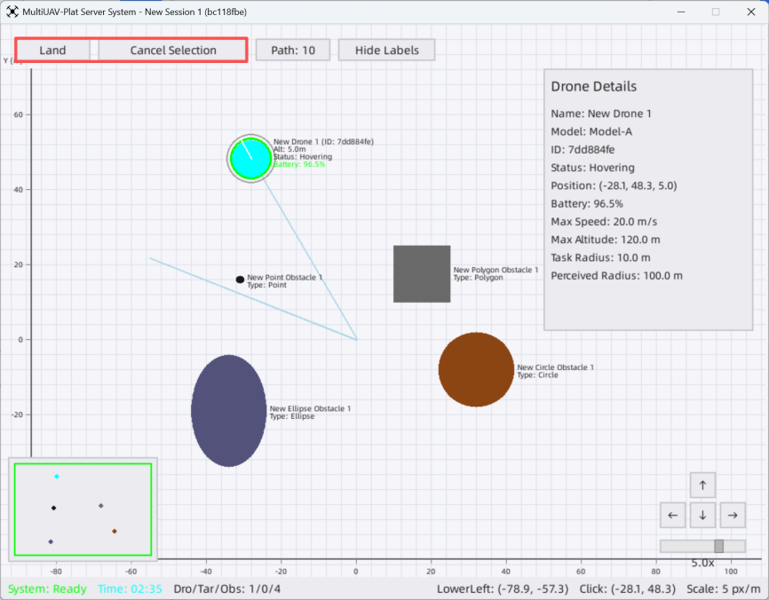
</p>

<p align="center"><em>Figure 4.1-2 Clicking the Take Off button to launch the drone</em></p>

Click anywhere on the map to move the drone there. Use "Land" to land and "Cancel Selection" to deselect.

## 4.2 Control System

On the console Drones tab, four buttons appear: "Take Off", "Land", "Move To", and "Control".

<p align="center">
  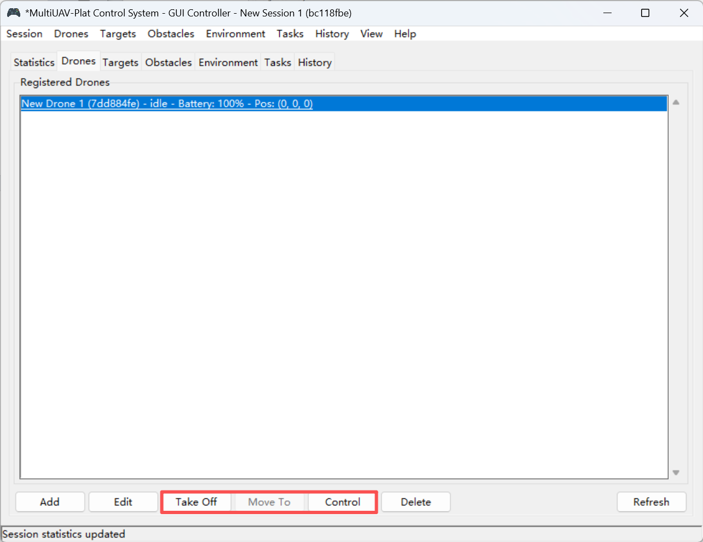
</p>

<p align="center"><em>Figure 4.2-1 Control buttons on the console Drones tab</em></p>

Select a drone and click "Take Off". A takeoff altitude dialog appears.

<p align="center">
  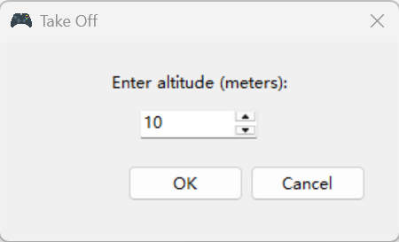
</p>

<p align="center"><em>Figure 4.2-2 Takeoff altitude dialog</em></p>

Set altitude and click "OK" to take off. Select the drone again and click "Move To" for a coordinate dialog.

<p align="center">
  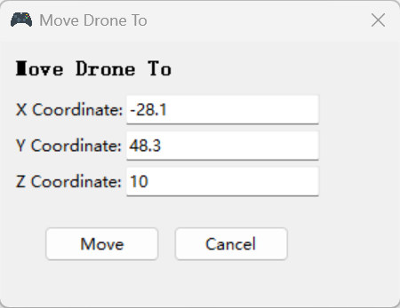
</p>

<p align="center"><em>Figure 4.2-3 Coordinate dialog</em></p>

Enter X/Y/Z and click "Move". Then select the drone and click "Land" to land.

For gamepad-style control, select a drone and click "Control".

<p align="center">
  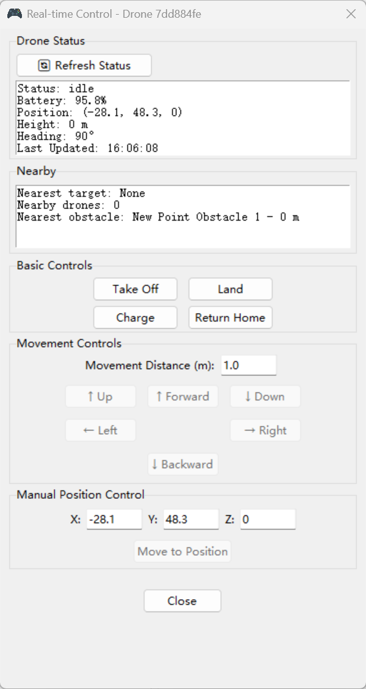
</p>

<p align="center"><em>Figure 4.2-4 Gamepad-style control interface</em></p>

**Drone Status:** Drone status

**Nearby:** Surroundings

**Basic Controls:** Basic commands

| Name | Meaning |
| --- | --- |
| Take Off | Take off |
| Land | Land |
| Charge | Charge |
| Return Home | Return home |

**Movement Controls:** Move the drone in six directions—forward, back, left, right, up, and down—with a configurable distance.

**Manual Position Control:** Set X/Y/Z coordinates and click **Move to Position** to fly the drone to that location.

# 5. Task Management

Edit and delete work like drones and are omitted.

## 5.1 Adding Tasks

Return to the console and open the "Tasks" tab.

<p align="center">
  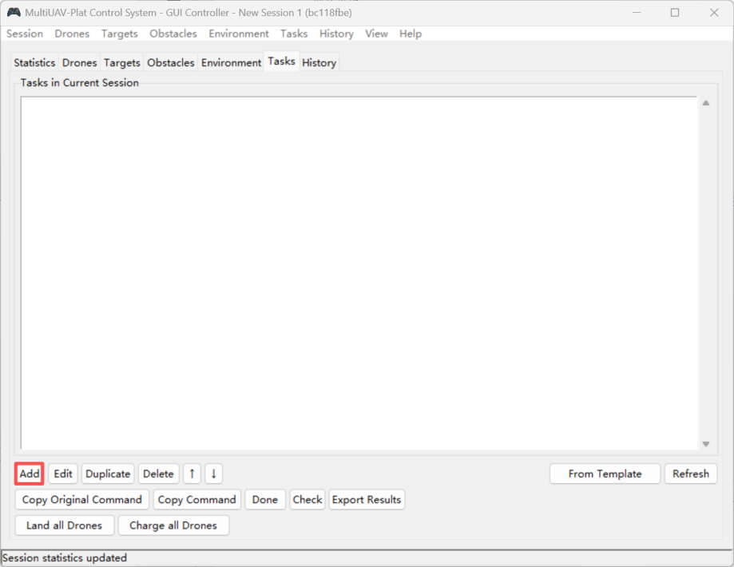
</p>

<p align="center"><em>Figure 5.1-1 The Tasks tab</em></p>

| Name | Meaning |
| --- | --- |
| Add | Add |
| Edit | Edit |
| Duplicate | Duplicate |
| ↑/↓ | Move up / Move down |
| From Template | Load from template |
| Refresh | Refresh |
| Copy Original Command | Copy original command |
| Copy Command | Copy command |
| Done | Mark done |
| Check | Check |
| Export Results | Export results |
| Land All Drones | Land all drones |
| Charge All Drones | Charge all drones |

Click "Add" to open the task creation dialog.

<p align="center">
  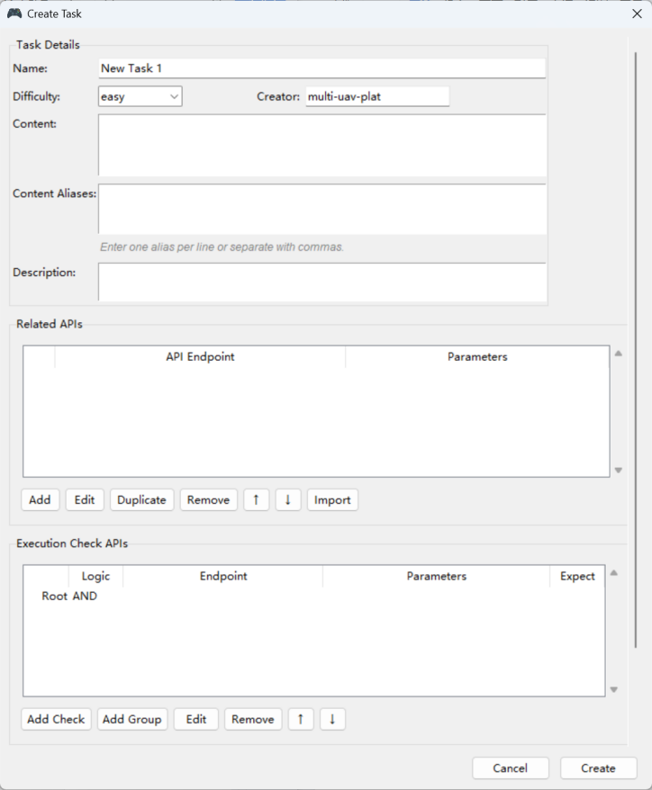
</p>

<p align="center"><em>Figure 5.1-2 Task creation dialog</em></p>

**Name:** Task name

**Creator:** Creator

**Difficulty:** Difficulty (3 options).

| Name | Meaning |
| --- | --- |
| easy | Easy |
| medium | Medium |
| hard | Hard |

**Content:** Task content

**Content Aliases:** Task aliases

**Description:** Task description

**Related APIs:** Linked server APIs. Click "Add" in the dialog, then choose **Category** to pick the API target object and **API Endpoint** to pick the specific command. After selection, the **Parameters** column shows the required arguments.

<p align="center">
  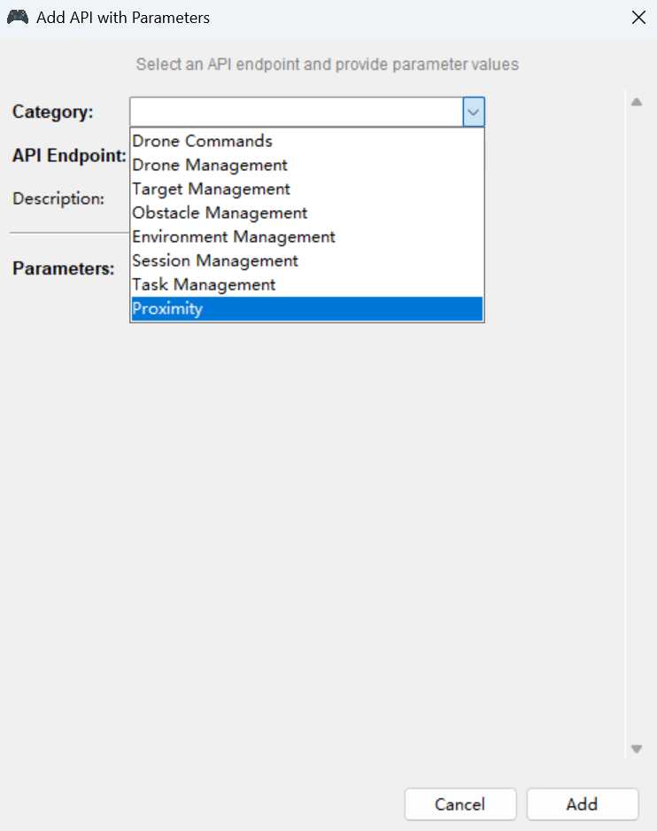
</p>

<p align="center"><em>Figure 5.1-3 Category selection for a related API</em></p>

<p align="center">
  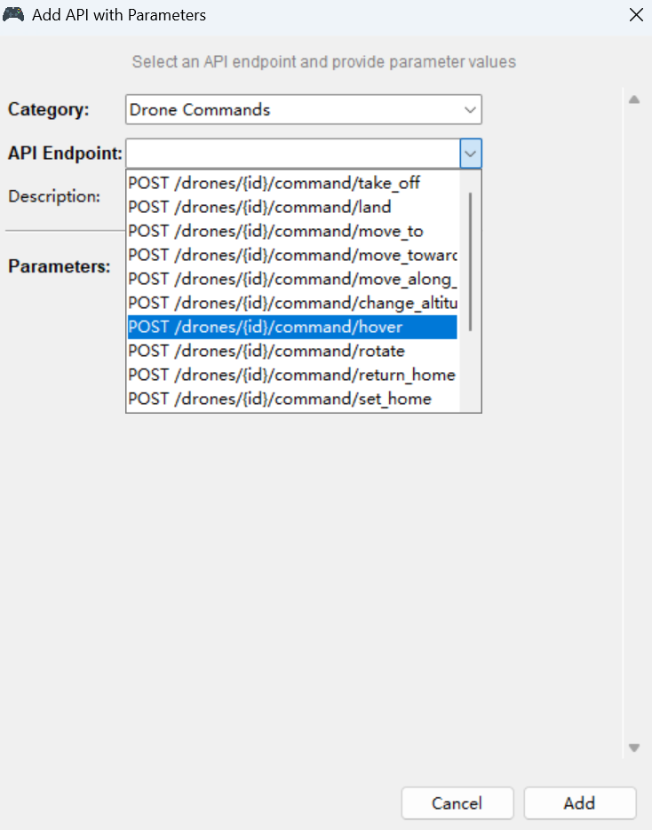
</p>

<p align="center"><em>Figure 5.1-4 Selecting a specific API endpoint</em></p>

<p align="center">
  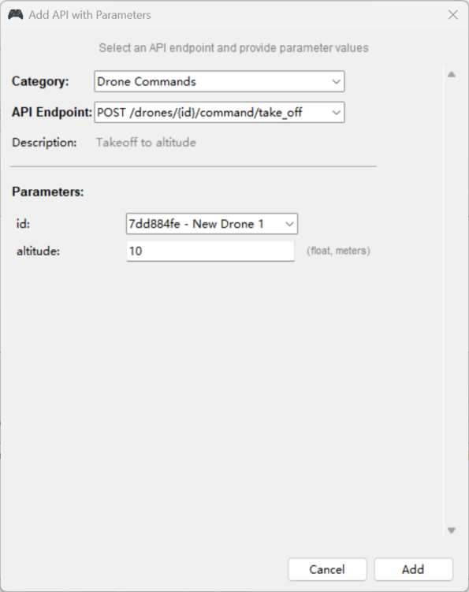
</p>

<p align="center"><em>Figure 5.1-5 Parameter display</em></p>

| Name | Meaning |
| --- | --- |
| Add | Add |
| Edit | Edit |
| Duplicate | Duplicate |
| Remove | Remove |
| ↑/↓ | Move up / Move down |
| import | Import |

**Execution Check APIs:** Execution check APIs

| Name | Meaning |
| --- | --- |
| Add Check | Add |
| Add Group | Add group |
| Remove | Remove |
| ↑/↓ | Move up / Move down |

## 5.2 Marking Task Completion

Select an incomplete task and click "Done" to mark it complete.

Select a completed task and click "Undone" to mark it incomplete.

<p align="center">
  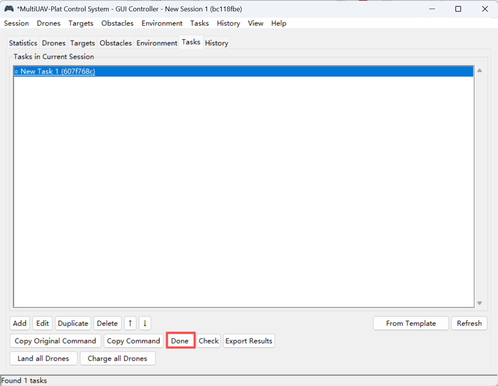
</p>

<p align="center"><em>Figure 5.2-1 Marking a task as completed</em></p>

<p align="center">
  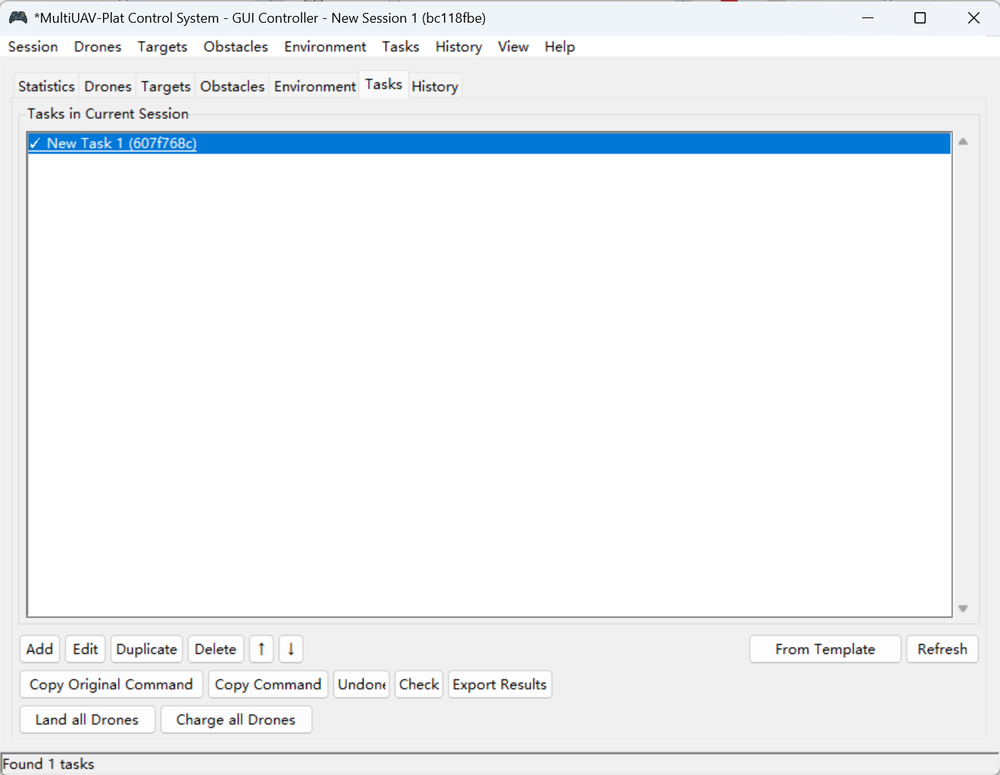
</p>

<p align="center"><em>Figure 5.2-2 Marking a task as incomplete</em></p>

## 5.3 Task Templates

In addition to creating tasks manually, the system provides task templates. A task template is a reusable task definition with placeholders (e.g., `{drone_1_name}`, `{random_altitude}`) instead of concrete entity names or values. Using templates lets you quickly and batch-generate structurally consistent tasks with varying parameters.

Templates come in two categories:

- **Built-in templates:** Common templates provided by the system (e.g., `basic_takeoff_land`, `patrol_mission`, `search_task`, `grid_search`, etc.). Cannot be deleted but can be duplicated into editable custom versions.
- **Custom templates:** Created by the user or duplicated from built-ins. Stored locally in `./templates/task_templates.json`.

### 5.3.1 Editing Task Templates

On the "Tasks" tab, click the "From Template" button to open the task template browser.

<p align="center">
  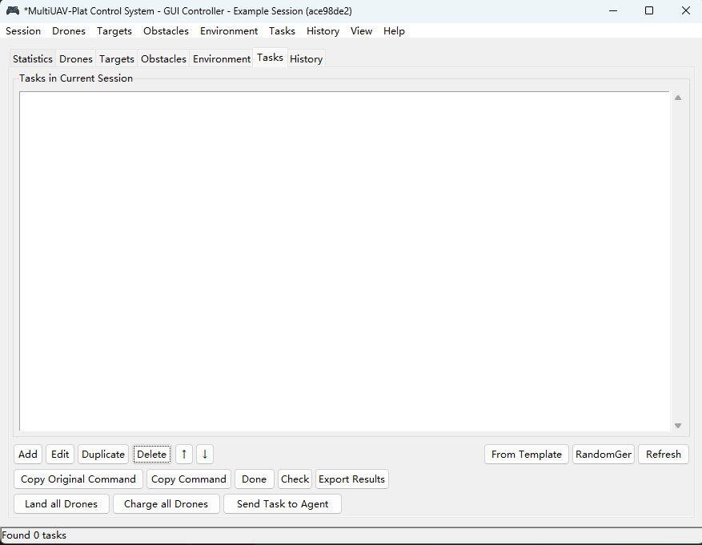
</p>

<p align="center"><em>Figure 5.3-1 The From Template button on the Tasks tab</em></p>

The task template browser lists all available templates (name, category, difficulty, applicable task types, check count). Selecting a template displays its description and task content below.

<p align="center">
  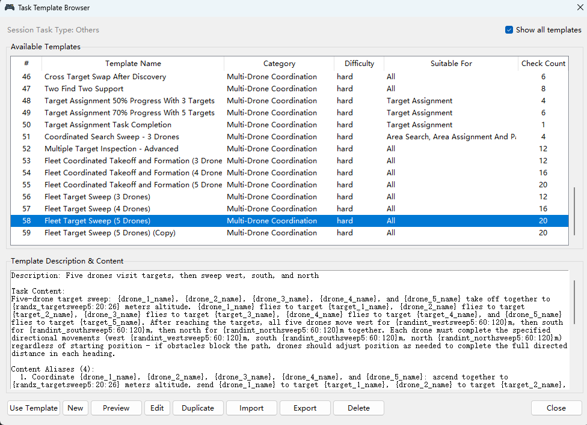
</p>

<p align="center"><em>Figure 5.3-2 Task template browser</em></p>

In the browser:

- Select a template to view its description and content.
- Click "Duplicate" on built-in templates to make an editable custom copy. A naming dialog appears.
- Click "Edit" or "Delete" on custom templates.

<p align="center">
  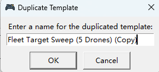
</p>

<p align="center"><em>Figure 5.3-3 Duplicating and naming a template</em></p>

Clicking "Edit" opens the template editor. Here you can modify the template name, category, difficulty, applicable task types, task content, aliases, description, related APIs, and execution check APIs. The right-side "Detected Placeholders" panel identifies placeholders used in the template; "Quick Insert" inserts common placeholders.

<p align="center">
  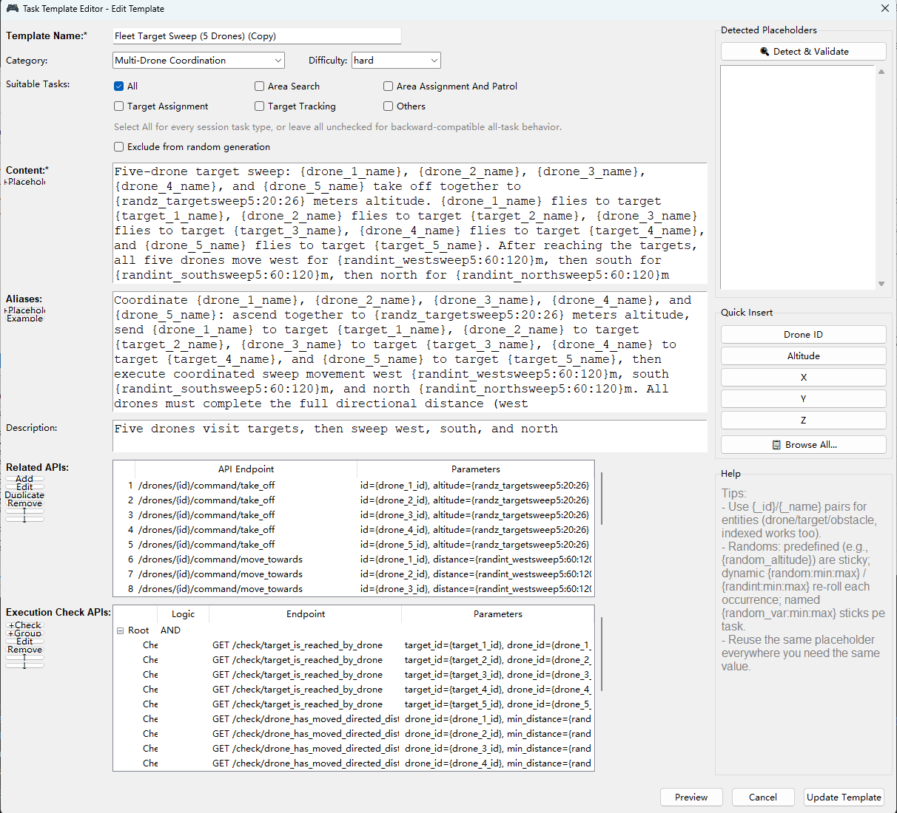
</p>

<p align="center"><em>Figure 5.3-4 Task template editor</em></p>

Main template fields:

| Field | Meaning |
| --- | --- |
| name | Template name (required) |
| description | Template description |
| content | Task body; may include placeholders |
| content_aliases | Alternative phrasing |
| difficulty | Difficulty (easy/medium/hard) |
| creator | Creator |
| category | Category |
| related_apis | Linked server APIs and parameters (supports placeholders) |

Common placeholders:

| Placeholder | Meaning |
| --- | --- |
| `{drone_id}` / `{drone_name}` | Single drone ID / name |
| `{drone_1_id}`…`{drone_5_id}` | Numbered drone IDs (same for `_name`) |
| `{target_1_id}` / `{obstacle_1_id}` | Numbered target / obstacle IDs |
| `{random_altitude}`, `{random_speed}`, etc. | Predefined randoms (consistent within a task) |
| `{random:min:max}`, `{randint:min:max}` | Custom-range randoms (new value per occurrence) |
| `{randxy}`, `{randxyz}`, `{randpos}` | Collision-avoiding random coordinates |
| `{mission_name}`, etc. | Free-text placeholders typed at generation time |

> Note: Numbered placeholders should use `_id` and `_name` in pairs so the UI can show entity dropdowns; the same numbered placeholder reuses the same entity when it appears multiple times in a template.

### 5.3.2 Generating Tasks from Templates

In the task template browser, select a template and double-click or click "Use Template". This opens the **Customize Template** dialog. Generate tasks as follows:

1. Enter a task name (required).
2. For entity placeholders (drones/targets/obstacles), either select a specific entity, choose `[RANDOM]` (random pick), or `[ORDERED]` (cycles through entities in order).
3. Enter values for free-text placeholders; random-type placeholders require no input.
4. Generate tasks:
   - Click **Create Task** to generate a single task.
   - Click **Batch Create** to generate multiple tasks — a dialog asks for the count; click **OK**. Task names are auto-numbered, and entities and random values are drawn independently for each generation.

<p align="center">
  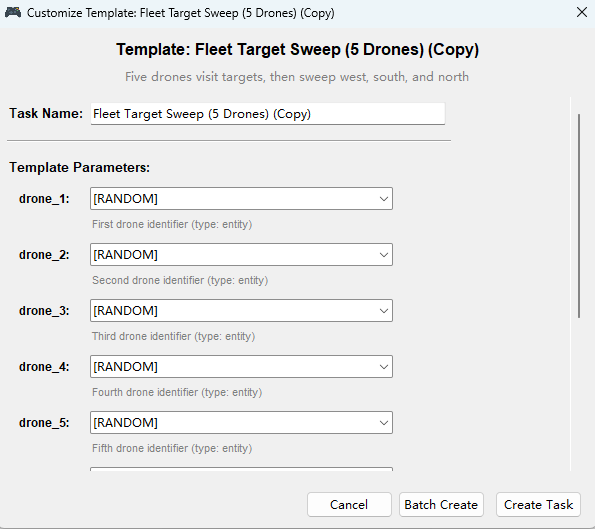
</p>

<p align="center"><em>Figure 5.3-5 Customize Template dialog</em></p>

<p align="center">
  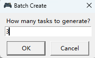
</p>

<p align="center"><em>Figure 5.3-6 Batch task creation count dialog</em></p>

When generating, the system resolves placeholders before creating tasks, so each task can have different entities and randomized parameters. This is ideal for quickly populating many test tasks.

# 6. AI Agent Auto-Check

The auto-check feature sends session tasks to the AI agent for execution, waits for completion, then evaluates task outcomes. Before using auto-check, you must first start the `agent4drone` intelligent agent service; otherwise the auto-check UI cannot send commands to the agent.

## 6.1 Starting the AI Agent Service (agent4drone)

The AI agent lives in the `agent4drone/` directory. It is a large-language-model (LLM) based drone control program with two usage modes:

| Mode | Start command | Purpose |
| --- | --- | --- |
| **REST service** | `python agent_api_service.py` | Used by the auto-check UI (CheckUI) for batch runs; default port `18000` |
| **Visual conversation UI** | `python main.py` | Enter natural-language commands manually and watch the agent execute in real time |

The sections below cover environment setup, starting the service, and the **full workflow for sending commands in the visual UI**.

### 6.1.1 Environment Setup

**Step 1 — Install dependencies (run once):**

```bash
cd agent4drone
pip install -r requirements.txt
```

**Step 2 — Configure the LLM.** Configure your LLM provider in `agent4drone/llm_settings.json` (e.g. Volcengine / 火山引擎, Ollama, or an OpenAI-compatible endpoint). Fill in the `api_key` field for the chosen provider, or pass the key via environment variables:

```bash
# Optional: pass the LLM key via environment variable
DEEPSEEK_API_KEY=sk-your-key-here
# Optional: UAV simulator URL (default http://localhost:8000)
UAV_API_URL=http://127.0.0.1:8000
UAV_API_KEY=
```

**Step 3 — Ensure the UAV simulation platform is running.** Whichever agent mode you use, start `MultiUAV-Plat.Server.exe` first and **Launch** the target session in the Controller so the session is active.

### 6.1.2 Starting the REST Service (for Auto-Check)

The auto-check UI connects to `http://localhost:18000` by default, so start the service mode:

```bash
cd agent4drone
python agent_api_service.py
```

Once running:

- Service address: `http://localhost:18000`
- Interactive documentation (Swagger): `http://localhost:18000/docs`

> If you only need manual conversational testing, skip this subsection and use the visual UI in Section 6.1.3.

### 6.1.3 Sending Commands in the Visual UI

The visual UI (**UAV Control Interface**) is ideal for manual debugging: describe tasks in natural language and observe how the agent understands, plans, and controls the drones.

**(1) Launch the UI**

From the project directory:

```bash
cd agent4drone
python main.py
```

This opens the **UAV Control Interface** window with four areas top to bottom: **LLM Provider**, **UAV Connection**, **Conversation / Intermediate Steps**, and the **Command** input area.

<p align="center">
  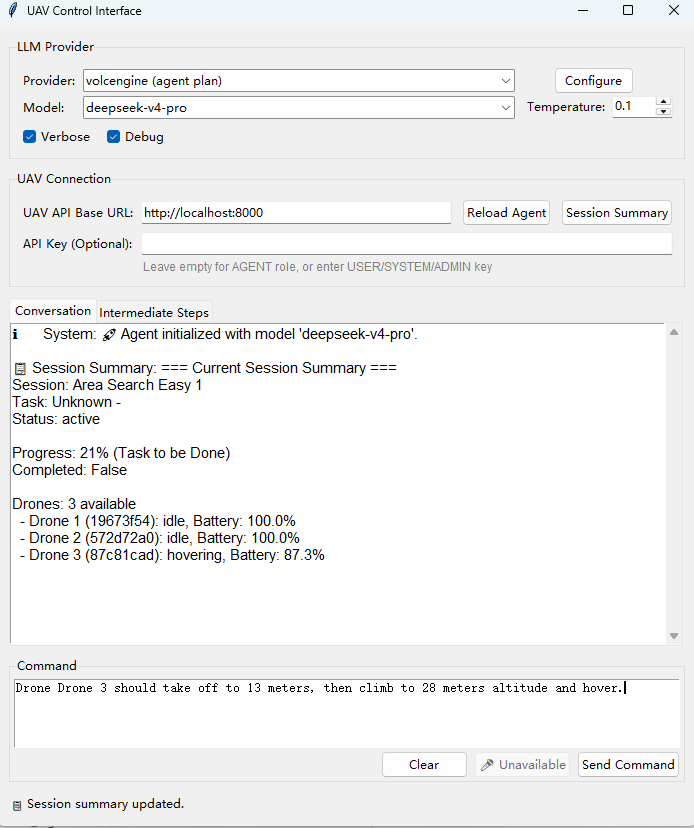
</p>

<p align="center"><em>Figure 6.1-1 UAV Control Interface and command input</em></p>

**(2) Configure LLM Provider**

In the **LLM Provider** area at the top:

| Control | Description |
| --- | --- |
| Provider | Select the LLM provider (e.g. `volcengine (agent plan)`) |
| Model | Select the model (e.g. `deepseek-v4-pro`) |
| Temperature | Controls output randomness; keep it low (e.g. `0.1`) |
| Verbose / Debug | When checked, the **Intermediate Steps** tab shows detailed reasoning and tool calls |
| Configure | Opens a dialog to edit Provider and API Key in `llm_settings.json` |

After configuration, the UI shows `Agent initialized with model '...'`, indicating the LLM is ready.

**(3) Configure UAV Connection**

In the **UAV Connection** area:

| Control | Description |
| --- | --- |
| UAV API Base URL | Simulator API address; default `http://localhost:8000` |
| API Key (Optional) | UAV platform key; usually leave empty for the AGENT role |
| Reload Agent | Reload the agent after changing settings or switching sessions |
| Session Summary | Refresh the current session summary (task progress, drone status, etc.) |

After clicking **Session Summary**, the **Conversation** area shows session info such as:

- Session name (e.g. `Area Search Easy 1`)
- Task type and completion progress (e.g. `21%`)
- Each drone's ID, status (`idle` / `hovering` / `flying`), and remaining battery

Before sending commands, confirm the target drone is ready (usually `idle` or already airborne in `hovering`).

**(4) Enter and Send Natural-Language Commands**

In the **Command** text box at the bottom, describe the action in natural language. Include: **which drone**, **what action**, and **key parameters** (altitude, coordinates, target name, etc.).

Example command:

```text
Drone Drone 3 should take off to 13 meters, then climb to 28 meters altitude and hover.
```

Meaning: Drone 3 takes off to 13 m, climbs to 28 m, and hovers.

Click **Send Command** to submit. The button is temporarily disabled to prevent duplicate submissions; switch to **Intermediate Steps** while the agent works to see step-by-step reasoning.

**(5) Review Results**

When execution finishes, the **Conversation** area typically shows:

1. **Step table:** The natural-language task broken into sub-steps (e.g. Descend to 13m → Climb to 28m → Hover) with per-step results;
2. **Final state:** Drone coordinates `(x, y, z)` and remaining battery;
3. **Completion marker:** `[TASK DONE]` at the end, meaning the agent considers the command complete.

<p align="center">
  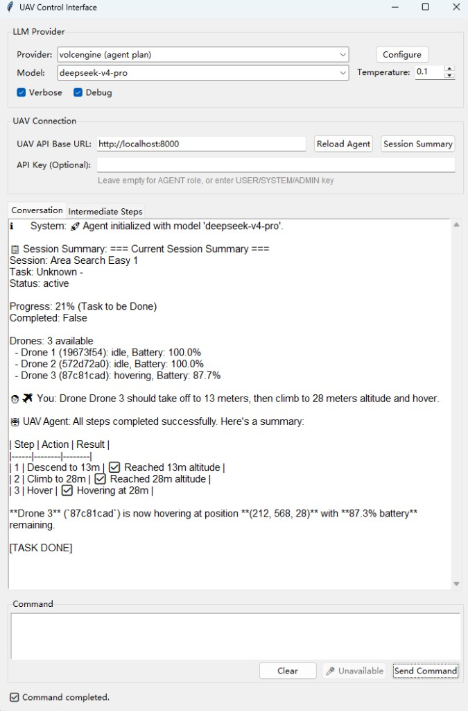
</p>

<p align="center"><em>Figure 6.1-2 Conversation log after command execution completes</em></p>

The **Command completed.** checkbox at the bottom is checked when processing ends. If the result is unexpected, revise the command and resend, or click **Reload Agent** and try again.

**(6) Visual UI Workflow Summary**

```text
Start Server + Launch session in Controller
        ↓
cd agent4drone && python main.py
        ↓
Configure LLM Provider (Provider / Model / API Key)
        ↓
Configure UAV Connection (Base URL) → Session Summary to confirm session and drone status
        ↓
Enter natural-language command → Send Command
        ↓
Review reasoning and execution in Conversation / Intermediate Steps
        ↓
Confirm [TASK DONE] and Command completed → send next command or close the UI
```

> **Tip:** The visual UI (`main.py`) and REST service (`agent_api_service.py`) share the same `llm_settings.json` configuration but run differently. Auto-check (from Section 6.2 onward) requires the REST service; manual debugging and demos are best done with the visual UI in this section.

After starting the agent service or opening the visual UI, proceed to Section 6.2 for auto-check, or continue testing task commands in the UI.

## 6.2 Entering the Auto-Check UI

In the session management window, click "CheckUI" to open the auto-check UI.

<p align="center">
  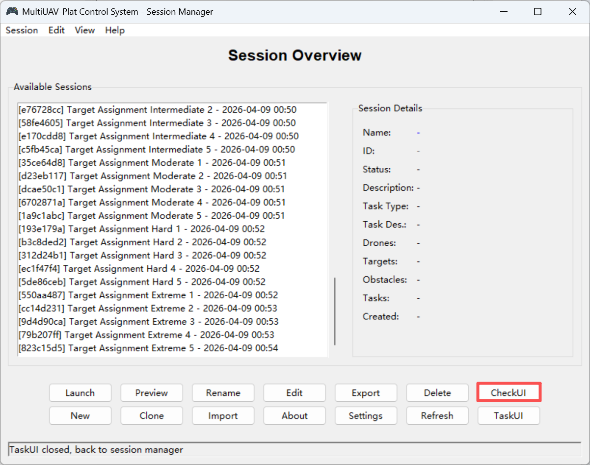
</p>

<p align="center"><em>Figure 6.2-1 Session Manager CheckUI button</em></p>

The auto-check UI is shown below.

<p align="center">
  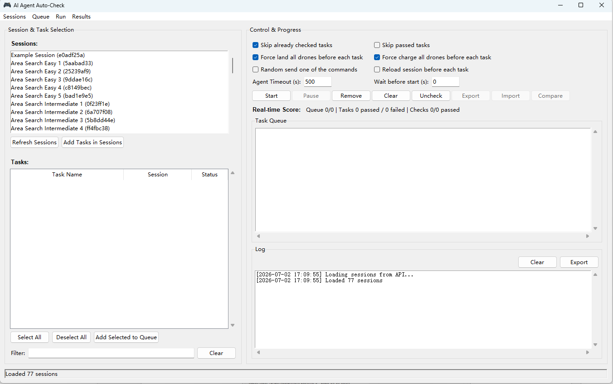
</p>

<p align="center"><em>Figure 6.2-2 Auto-check interface</em></p>

**Session & Task Selection:** Session and task selection

| Name | Meaning |
| --- | --- |
| Refresh Sessions | Refresh sessions |
| Add Tasks in Sessions | Add tasks from sessions |

**Control & Progress:** Control and progress

| Name | Meaning |
| --- | --- |
| Skip already checked tasks | Skip already checked tasks |
| Skip passed tasks | Skip passed tasks |
| Force land all drones before each task | Force land all drones before each task |
| Force charge all drones before each task | Force charge all drones before each task |
| Random send one of the commands | Randomly send one command |
| Reload session before each task | Reload session before each task |
| Start | Start |
| Pause | Pause |
| Clear | Clear |
| Uncheck | Mark unchecked |
| Export | Export |
| Import | Import |
| Agent Timeout | Agent timeout |

## 6.3 Importing Sessions

Select session(s) under "Sessions"; tasks appear under "Tasks". Click "Add Tasks in Sessions" to queue them.

<p align="center">
  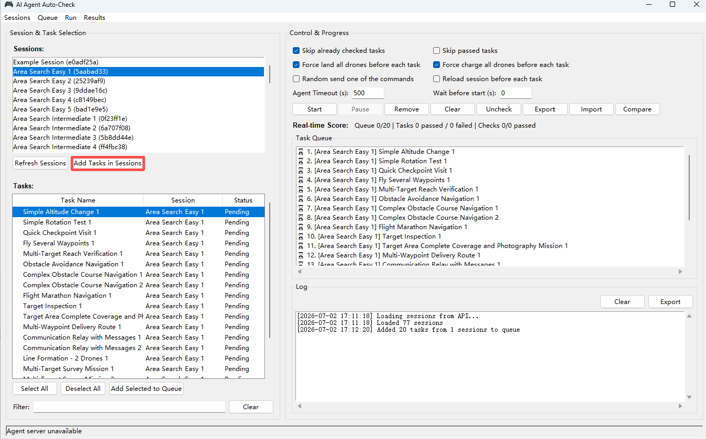
</p>

<p align="center"><em>Figure 6.3-1 Importing sessions</em></p>

## 6.4 Running Checks

Configure options as needed, then click **Start** to run checks; **Pause** to pause; **Clear** to reset the list; select a task and click **Uncheck** to mark it unchecked; **Export / Import** to save or load check results.

<p align="center">
  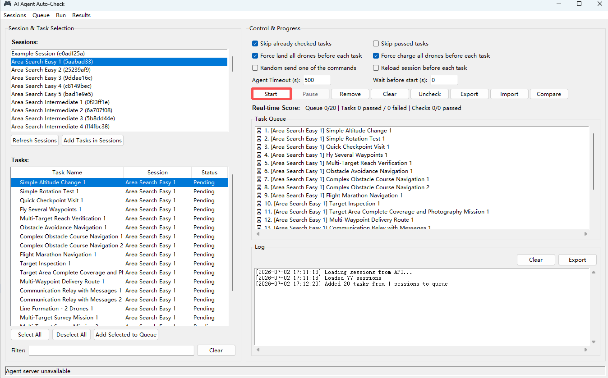
</p>

<p align="center"><em>Figure 6.4-1 Running the auto-check</em></p>

### 6.4.1 Batch Check Running State

After clicking **Start**, the UI enters batch-check running state. The **Control & Progress** area on the right updates queue progress, task results, and log output in real time so you can watch the agent execute tasks one by one.

<p align="center">
  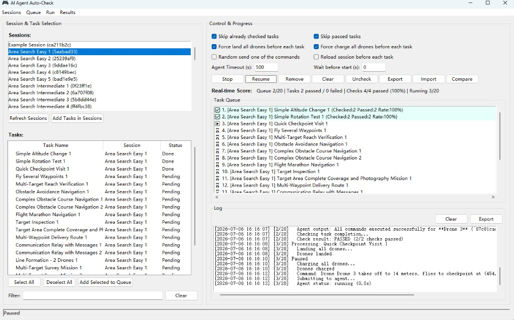
</p>

<p align="center"><em>Figure 6.4-2 UI state while a batch check is running</em></p>

The meaning of each area during a run is described below.

**(1) Left side: Sessions and Tasks**

| Area | Behavior during a run |
| --- | --- |
| **Sessions** | Lists sessions added to the check queue; the active session (e.g. `Area Search Easy 1`) is selected |
| **Tasks** | Lists all tasks in that session and their **Status**: completed tasks show **Done**, pending tasks show **Pending** |

The Tasks table on the left reflects original session task states; the Task Queue on the right reflects real-time batch progress. Compare both for a full picture.

**(2) Top right: Control & Progress**

During a run you can control the batch with:

| Button | Action |
| --- | --- |
| **Stop** | Stop the current batch check |
| **Pause / Resume** | Pause or resume; when paused the status bar shows `Paused` and **Resume** is highlighted |
| **Remove** | Remove the selected task from the queue |
| **Clear** | Clear the entire check queue (use after a run finishes) |
| **Uncheck** | Mark the selected task as unchecked for re-run |
| **Export / Import** | Export or import check results |
| **Compare** | Compare two check result sets |

Common options:

- **Force land all drones before each task:** Land all drones before each task for independent runs;
- **Force charge all drones before each task:** Charge all drones before each task;
- **Agent Timeout (s):** Maximum wait time per task for the agent (e.g. `500` seconds); timeout counts as failure;
- **Wait before start (s):** Delay in seconds after clicking Start before execution begins.

**(3) Real-time Score**

The statistics row below the control buttons looks like:

```text
Queue 2/20 | Tasks 2 passed / 0 failed | Checks 4/4 passed (100%) | Running 3/20
```

| Field | Meaning |
| --- | --- |
| `Queue 2/20` | 2 of 20 queue items completed |
| `Tasks 2 passed / 0 failed` | 2 tasks passed, 0 failed |
| `Checks 4/4 passed (100%)` | All 4 verification checkpoints passed |
| `Running 3/20` | Currently executing task 3 of 20 |

**(4) Task Queue**

The Task Queue uses icons and colors for each task:

| Visual | Meaning |
| --- | --- |
| **Light blue highlight** + suffix `(Checked:2 Passed:2 Rate:100%)` | Task finished checking with pass count and rate |
| **▶ play icon** | Task currently running (e.g. `Quick Checkpoint Visit 1`) |
| **⏳ hourglass icon** | Task waiting in queue |

**(5) Log**

The Log window outputs detailed progress in time order. Typical entries:

```text
[3/20] Current progress (task 3 of 20)
Agent output: All commands executed successfully   ← Agent execution feedback
Check result: PASSED                               ← Task verification result
Landing all drones / Drones landed                 ← Pre-task forced landing (if enabled)
Charging all drones                                ← Pre-task forced charging (if enabled)
Submitting to agent                                ← Submitting command to agent
Command: Drone Drone 3 takes off to 14 meters...  ← Task text sent to agent
```

Use the Log to trace what the agent received, whether execution succeeded, and whether platform verification passed.

**(6) Bottom status bar**

The bottom status bar shows overall state, for example:

- **Running:** Batch check in progress;
- **Paused:** Paused; click **Resume** to continue;
- **Stopped / Idle:** Stopped or not started.

**(7) Batch check flow summary**

```text
Select check options → Click Start
        ↓
Real-time Score and Task Queue update progress
        ↓
Current task (▶) → Submit Command to Agent (port 18000) → Wait for execution
        ↓
Log shows Agent output and Check result (PASSED / FAILED)
        ↓
Completed queue entry turns blue; next task starts (⏳ → ▶)
        ↓
When all done, Export JSON report
```

> **Tip:** Batch checks depend on the REST service started in Section 6.1.2 (`agent_api_service.py`). If the Log shows agent connection failures, confirm `http://localhost:18000/health` responds normally and that the UAV Server and target session are both Launch-active.

# 7. 3D Visualization Viewer

The 3D viewer is a standalone Three.js-based web application in the `view3d/` directory. It reads the platform's current session data and renders it as an interactive 3D scene, visualizing drones, targets, obstacles, altitude lines, path histories, coverage areas, and more.

## 7.3.1 Requirements and Interface Overview

**Requirements:**

- **Node.js 18** or later
- **UAV API Server** (optional): When running, live session data is shown; otherwise the viewer falls back to demo mode

After startup, the browser opens **MultiUAV-Plat 3D Viewer**. By default it shows the current session in **Fit (panorama)** view, displaying drones, targets, obstacles, and axes at once. Roam mode is not active yet—this is a good first look at the 3D viewer.

<p align="center">
  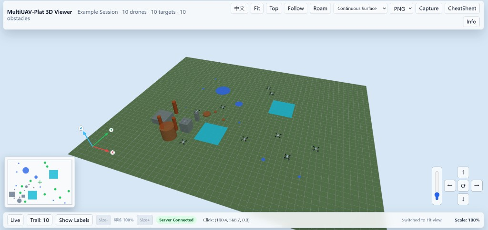
</p>

<p align="center"><em>Figure 7.1-1 Default 3D visualization viewer interface</em></p>

The toolbar offers Fit / Top / Follow / Roam view switches (**Fit** selected by default); the center shows a gridded 3D scene with quadcopter models, blue target areas, and colored obstacle columns; the minimap is bottom-left; **Server Connected** at the bottom indicates a successful connection to the simulation platform.

## 7.3.2 Starting the 3D Viewer

Before starting, enter the `view3d/` directory and install dependencies:

```bash
cd view3d
npm install
```

After installation, start the dev server:

```bash
npm run dev
```

On Windows PowerShell, you can also start it this way:

```powershell
$env:VITE_VIEWER_DATA_SOURCE="backend"; npx vite --host 127.0.0.1 --port 5173
```

Then open **http://127.0.0.1:5173/** in your browser to see the 3D interface shown in Figure 7.1-1.

## 7.3.3 Interface Layout

The 3D viewer is organized into **top toolbar**, **central 3D scene**, and **bottom status bar**.

**(1) Top toolbar**

| Control | Description |
| --- | --- |
| Title bar | Shows `MultiUAV-Plat 3D Viewer` and session summary (name, drone/target/obstacle counts) |
| **Fit** | Panorama view—auto-fit the camera to the whole scene (see Figure 7.1-1) |
| **Top** | Top-down view of the task area |
| **Follow** | Follow mode—camera tracks the selected drone |
| **Roam** | Roam mode—first-person flight along the selected drone's path history (see Section 7.3.7) |
| **Continuous Surface** | Ground rendering mode dropdown |
| **PNG / Capture** | Export the current view as an image |
| **CheatSheet / Info** | Shortcut reference and help |
| **中文** | Switch UI language |

**(2) Central 3D scene**

All session entities are shown in 3D:

- **Drones:** Quadcopter models with ID labels, altitude lines, and current state
- **Targets:** Blue areas on the ground (circles, rectangles, polygons, etc.)
- **Obstacles:** Cylinders, boxes, and other solids (gray, orange, blue, etc.)
- **Axes:** X (red) / Y (green) / Z (blue) at the scene origin
- **Trail lines:** Green lines recording flight path history
- **Coverage area:** Task coverage visualization

**(3) Bottom status bar**

| Area | Description |
| --- | --- |
| **Minimap** (bottom-left) | 2D overview; green dots are drones, blue/red blocks are targets and obstacles; click to jump the view |
| **Live / Trail / Show Labels** | Live refresh toggle, trail length, label visibility |
| **Size- / label / Size+** | Adjust label font size |
| **Server Connected** | Green when connected to the UAV API server with live data sync |
| **Task: xx%** | Current session task completion (shown when backend is connected) |
| **Click: (x, y, z)** | 3D coordinates at the mouse click point |
| **Arrow controls** (bottom-right) | Pan / rotate the view manually |
| **Zoom slider** (bottom-right) | Vertical slider for quick zoom; Scale percentage shown beside it |

For reference, here is the 2D simulation interface side by side:

<p align="center">
  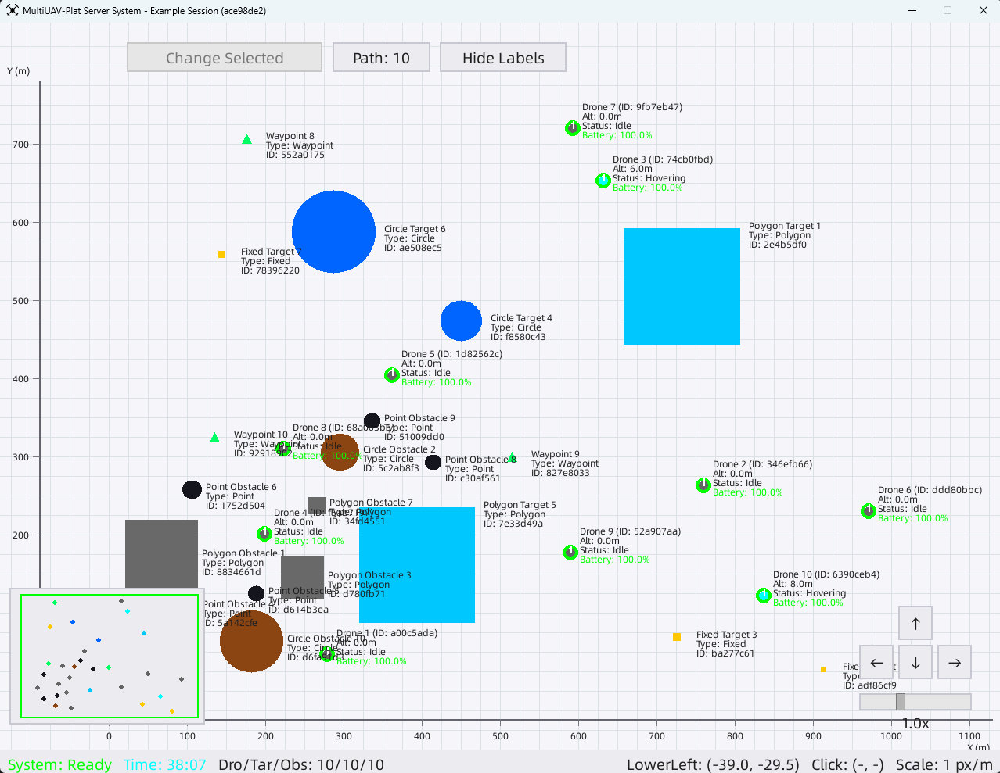
</p>

<p align="center"><em>Figure 7-2 2D simulation system interface (for comparison)</em></p>

## 7.3.4 Basic Operations

| Operation | Description |
| --- | --- |
| **Left click** | Select a drone/target/obstacle and inspect details |
| **Right click** | Deselect |
| **Mouse drag** | Orbit the camera |
| **Scroll wheel** | Zoom (40% to 500%) |
| **Fit / Top / Follow / Roam** | Toolbar view switches: panorama / top-down / follow / roam |
| **Info button** | Open the selected object's detail drawer |
| **Show Labels** | Show or hide entity name labels |
| **Size- / Size+** | Adjust label size |
| **Trail** | Toggle path history display length |
| **Zoom slider** (bottom-right) | Vertical slider for quick zoom |
| **PNG / Capture** | Export the current canvas image |

## 7.3.5 Keyboard Shortcuts

| Shortcut | Action |
| --- | --- |
| `Esc` | Deselect (exit roam mode when roaming) |
| Arrow keys | Pan the view |
| `1` | Fit all to view |
| `2` | Top-down view |
| `3` | Follow selected drone |
| `4` | Roam mode (fly along the selected drone's path) |
| `.` (period) | Speed up roam |
| `,` (comma) | Slow down roam |
| `+` / `-` | Zoom in / out |
| `[` / `]` | Decrease / increase label size |
| `R` | Reset view |
| `L` | Show / hide labels |
| `M` | Show / hide minimap |
| `I` | Show / hide info panel |

## 7.3.6 Backend-Linked Live Visualization

When the 3D viewer runs alongside the UAV API server, it displays live session state:

1. **Start the UAV API Server** (`MultiUAV-Plat.Server.exe`) and open a session containing drones, targets, and other entities.
2. **Start the 3D Viewer** — Vite automatically fetches session data from `GET /sessions/current/data`.
3. **Control drones** in the simulation or via the controller; refresh the viewer scene to see live position, trail, and status updates.

If the UAV API server is not running, the viewer automatically falls back to **Demo Mission mode**, showing a preset sample scene so you can explore the viewer's capabilities without a backend. The top-left corner will show "Not connected / Failed to fetch".

<p align="center">
  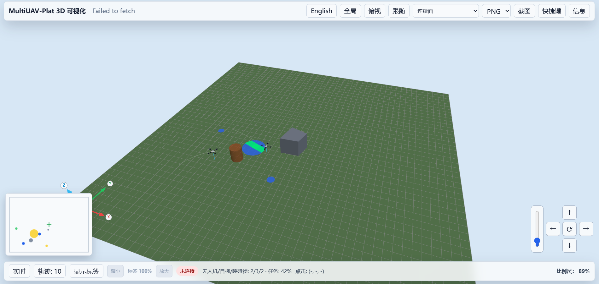
</p>

<p align="center"><em>Figure 7.6-1 3D scene in demo mode (no backend connected)</em></p>

## 7.3.7 Roam Mode

Roam mode is a **first-person path flight** view: the camera advances automatically along the selected drone's historical flight path, simulating the drone's perspective on the mission. Figure 7.7-1 shows roam mode in the `Area Search Easy 1` session.

<p align="center">
  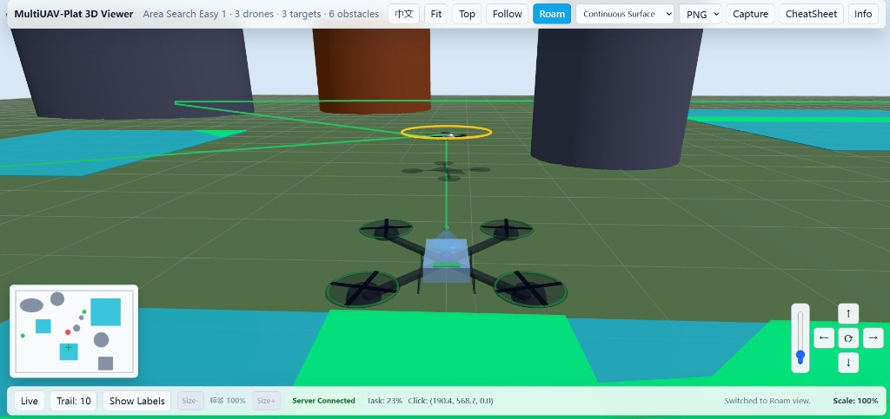
</p>

<p align="center"><em>Figure 7.7-1 Roam mode (Roam view, Area Search Easy 1)</em></p>

The camera sits close to the **Drone 3** quadcopter model; a semi-transparent blue bounding box marks the tracked drone; green lines on the ground show the remaining path; another drone ahead is marked with a yellow highlight ring; the status bar shows `Switched to Roam view` and `Task: 23%`.

### Entering Roam Mode

1. **Select a drone in the 3D scene** (left click, or Tab to cycle selection).
2. **Click the Roam button** in the top toolbar, or press **`4`**.
3. The camera moves to the start of that drone's path history and begins flying along it.

> Note: If the selected drone has insufficient path history (fewer than 2 waypoints), roam mode cannot start. Fly the drone in the 2D simulator or via the agent first to record a path.

### Visual Elements During Roam

| Element | Description |
| --- | --- |
| **Green path line** | Remaining path ahead; shortens as roam progresses |
| **Semi-transparent drone model** | Quadcopter in front of the camera indicating forward direction |
| **Yellow highlight ring** | Marks other drones or objects of interest in the scene |
| **Roam button highlighted** | **Roam** is selected in the toolbar; status bar shows `Switched to Roam view` |

### Controls During Roam

| Action | Description |
| --- | --- |
| **Press `.` (period)** | Speed up (×1.25) |
| **Press `,` (comma)** | Slow down (÷1.25) |
| **Scroll wheel** | Adjust camera distance from the path point (zoom) |
| **Press `Esc`** | Exit roam mode and return to Fit panorama view |
| **Press `4` / click Roam again** | Exit roam mode |
| **Change selected drone** | Automatically exits roam mode |

Roam speed is based on the drone's maximum speed property and can be adjusted between **25% and 400%**. The status bar shows the current roam speed percentage, e.g. `Roam speed: 100%`.

### Smooth Path Turns

At path corners, roam mode smooths the camera transition: as the camera approaches a turn, its forward direction blends between the previous and next path segments. Turn distance scales with speed (faster speed starts turning earlier) for a natural flight perspective.

### Reaching the End

When the camera reaches the path end, roam stops and holds the final position. Press `Esc` or `4` to exit roam and return to free view (Fit / Top / Follow).
